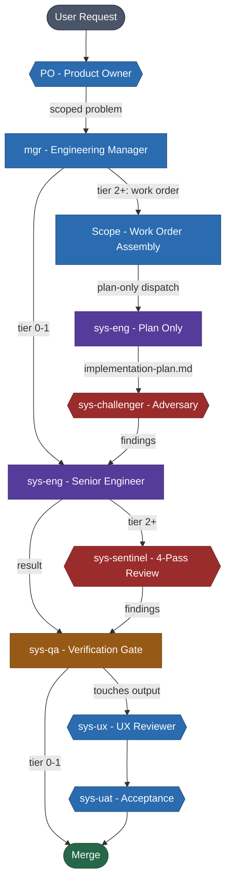

# RDF - rfxn Development Framework

Convention governance, agent pipelines, and project orchestration for the
rfxn ecosystem. Tool-agnostic by design, currently delivered via Claude Code.

**Version:** 2.0 | **License:** GNU GPL v2 | **Author:** Ryan MacDonald <ryan@rfxn.com>

> **This is not a drop-in framework.** RDF is purpose-built for the rfxn
> ecosystem and shared as a reference for what disciplined AI-assisted
> development can look like. The value here is the pattern, not the files.
> Engineering organizations looking to get consistent, reliable output from
> AI coding assistants should study the approach: typed agent pipelines,
> adversarial quality gates, convention inheritance, and context window
> management. The goal is autonomous execution that does not require
> babysitting the model on every commit.

---

## Why This Exists

This framework emerged from 6 months of daily AI-assisted development
across the full rfxn product ecosystem.

AI coding assistants are powerful, but they have no memory between sessions,
no concept of project conventions, and no quality gates. Left unsupervised,
they introduce subtle regressions, ignore platform constraints, and produce
code that passes lint but fails in production.

Over 6 months across 10 production projects, we learned this the hard way.
Bugs that linters cannot catch -- silent behavior changes in refactored
functions, empty variable propagation, compatibility violations across
target platforms, regressions introduced by code that looks correct in
isolation but breaks integration contracts -- kept recurring. Each incident
added a rule. Each rule needed enforcement. Manual enforcement does not
scale across 10 projects and 6 shared libraries.

RDF is the result: a governance layer that sits between the human and the AI
runtime. It encodes what we learned into typed agent personas with defined
protocols, adversarial review gates, and convention inheritance that every
project gets automatically. The AI still writes the code. RDF makes sure
it writes it correctly.

| Metric | Value |
|--------|-------|
| Active servers | ~350,000 |
| Daily check-ins | Signatures, updates, telemetry |
| Total commits | 1,686 |
| Code (production) | 31,176 lines |
| Test code (BATS) | 70,965 lines |
| Test cases | 5,764 |
| Governance framework | 14,204 lines |
| Net code churn | +271K / -111K lines |

Every convention, anti-pattern rule, and quality gate in this framework
exists because a real bug, regression, or production incident taught us
it was necessary. When your code runs on 350,000 servers and a bad push
changes their security posture overnight, the margin for error is zero.

---

## Production Scale

The rfxn product line is production security infrastructure deployed
across approximately 350,000 active servers. Every day, those servers
pull signature updates, version checks, and telemetry. A bad push is
not a GitHub issue -- it is a security event across hundreds of thousands
of machines.

**What these tools protect:**

- **APF** (Advanced Policy Firewall) -- network-level access control,
  rate limiting, and connection-state enforcement
- **LMD** (Linux Malware Detect) -- filesystem malware scanning with
  daily signature updates, quarantine, and alerting
- **BFD** (Brute Force Detection) -- real-time authentication attack
  detection and automated blocking

**Where they run:**

The install base reaches well beyond web hosting. Cloudflare ASN
telemetry shows daily check-ins from government agencies (NIST, NOAA,
NIH), defense networks (NATO CCDCOE), universities (Stanford, Harvard,
National Taiwan University), and national research networks across
Europe (DFN, RENATER, JANET, SURFnet, RedIRIS, GARR).

Enterprise and telecom networks include AWS, Microsoft, Google, Deutsche
Telekom, Vodafone, and Telefonica. Hosting and infrastructure providers
span Liquid Web, DigitalOcean, Hetzner, OVHcloud, Vultr, Bluehost,
Contabo, and Leaseweb. Deployments run across cPanel, Plesk, and
DirectAdmin environments as well as bare-metal and cloud configurations.

**What goes wrong when code is wrong:**

A false positive in LMD signature matching quarantines legitimate files
on every server that pulls the update -- at scale, that is a mass outage
disguised as a security response. A regression in APF rule parsing can
lock administrators out of their own servers or silently degrade firewall
posture. A behavior change in BFD threshold logic either floods block
lists with false positives or stops detecting real attacks. These are
security tools. A regression does not break a feature -- it changes the
security posture of every server running the update.

This is why RDF exists. The governance overhead is proportional to the
blast radius.

---

## What This Is

AI models have a fixed context window. Fill it with everything and the
model knows a little about a lot -- it writes plausible code that misses
project-specific constraints. RDF solves this by splitting work across
typed agent personas, each loaded with a small, highly specific context
window scoped to exactly one job.

A QA agent does not see implementation details -- it sees the diff, the
test results, and the verification protocol. A Sentinel agent does not
see the requirements discussion -- it sees the code and runs four
adversarial passes. Each agent is a context buffer: a narrow, deep
window into exactly the information that role needs to do its job well.

The ~66 slash commands work the same way. Each command is a skill scoped
to a specific task -- `/rel-prep` knows how to verify a release is ready,
`/audit-security` knows how to hunt for injection vectors, `/test-impact`
knows how to map a code change to the test files that cover it. The
agent does not need to figure out how to do the job. The command tells it
exactly what to check, in what order, and what output to produce.

Together, the agents and commands form a typed engineering pipeline:

- **Agent personas** -- 12 context-buffered roles with defined protocols,
  each seeing only what that role needs
- **Commands** (slash-invokable skills) -- ~66 task-specific procedures
  for audit, release, testing, and project management
- **Hook scripts** -- pre-commit validation, context display, and event
  capture that run automatically
- **Profiles** -- 4 domain profiles (core, systems-engineering, security,
  frontend) that scope agents and governance to the project type
- **Convention governance** -- inherited by every project via CLAUDE.md
  so standards are structural, not aspirational

RDF is not a runtime. Claude Code (or Gemini CLI) is the runtime. RDF
tells the runtime how to behave -- and more importantly, what to focus on.

> **Detailed references:**
> [RDF.md](RDF.md) - Architecture, scope, risk, target structure
> [WORKFORCE.md](WORKFORCE.md) - Org chart, pipeline views, command cheat sheet, workflows
> [reference/diagrams.md](reference/diagrams.md) - Visual pipeline and architecture diagrams (Mermaid)

---

## Pipeline



> See [reference/diagrams.md](reference/diagrams.md) for all diagrams:
> SE protocol, Sentinel passes, audit pipeline, verification gate,
> RDF architecture, project ecosystem, and file-based handoff sequence.

| Role | Model | Purpose |
|------|-------|---------|
| Engineering Manager - mgr | sonnet | Orchestrator - prioritize, delegate, quality gates |
| Product Owner - po | sonnet | Requirements translation, scope gating (optional) |
| Scoping & Work Orders - scope | sonnet | Work order assembly, impact analysis, complexity assessment |
| Pre-Impl Adversary - sys-challenger | sonnet | Design flaws, edge cases, simpler alternatives |
| Senior Engineer - sys-eng | opus | 7-step execution protocol, implementation |
| QA Engineer - sys-qa | sonnet | Verification gate - 6-step review, bash 4.1 compliance |
| Post-Impl Adversary - sys-sentinel | opus | 4-pass review: anti-slop, regression, security, performance |
| UX & Output Design - sys-ux | sonnet | CLI output, help text, error messages (trigger-based) |
| User Acceptance Testing - sys-uat | sonnet | Sysadmin persona - Docker install, real-world scenarios |
| Security Engineer - sec-eng | opus | Offensive/defensive security assessment |
| Frontend QA Engineer - fe-qa | sonnet | API contracts, DOM, CSS, JS patterns |
| Frontend UAT Engineer - fe-uat | sonnet | Playwright headless scenarios |

---

## Inventory

### Agents - `canonical/agents/` (12)

**Core (3):**

| File | CC Name | Model | Role |
|------|---------|-------|------|
| mgr.md | rfxn-mgr | sonnet | Engineering Manager - orchestrate, delegate, quality gates |
| po.md | rfxn-po | sonnet | Product Owner - intake, requirements, scope gating |
| scope.md | rfxn-scope | sonnet | Scoping & research - impact analysis, work order assembly |

**Systems Engineering (6):**

| File | CC Name | Model | Role |
|------|---------|-------|------|
| sys-eng.md | rfxn-sys-eng | opus | Senior Engineer - 7-step execution protocol |
| sys-qa.md | rfxn-sys-qa | sonnet | QA Engineer - 6-step verification gate |
| sys-uat.md | rfxn-sys-uat | sonnet | UAT - sysadmin persona, Docker scenarios |
| sys-sentinel.md | rfxn-sys-sentinel | opus | Post-impl adversary - 4-pass review |
| sys-challenger.md | rfxn-sys-challenger | sonnet | Pre-impl adversary - design flaws, edge cases |
| sys-ux.md | rfxn-sys-ux | sonnet | UX/output design - CLI, help text, man pages |

**Security (1):**

| File | CC Name | Model | Role |
|------|---------|-------|------|
| sec-eng.md | rfxn-sec-eng | opus | Security engineer - offensive/defensive assessment |

**Frontend (2):**

| File | CC Name | Model | Role |
|------|---------|-------|------|
| fe-qa.md | rfxn-fe-qa | sonnet | Frontend QA - API contracts, DOM, CSS, JS |
| fe-uat.md | rfxn-fe-uat | sonnet | Frontend UAT - Playwright headless scenarios |

### Commands - `canonical/commands/` (~66)

**Personas (12):** `mgr`, `sys-eng`, `sys-qa`, `sys-uat`, `po`, `scope`,
`sys-sentinel`, `sys-challenger`, `sys-ux`, `sec-eng`, `fe-qa`, `fe-uat`

**Audit pipeline (24):** `audit`, `audit-quick`, `audit-delta`,
`audit-compile`, `audit-condense`, `audit-context`, `audit-plan`,
`audit-feedback`, `audit-schema`, `audit-regression`, `audit-latent`,
`audit-security`, `audit-standards`, `audit-version`, `audit-cli`,
`audit-docs`, `audit-config`, `audit-test-coverage`, `audit-test-exec`,
`audit-install`, `audit-build-ci`, `audit-upgrade`, `audit-interfaces`,
`audit-modernize`
*(+ 2 deprecated stubs: `audit-dedup`, `audit-synthesis` -- contain
deprecation notice pointing to reformed pipeline)*

**Release (7):** `rel-prep`, `rel-ship`, `rel-merge`, `rel-notes`,
`rel-chg-dedup`, `rel-chg-diff`, `rel-scrub`

**Project (6):** `proj-status`, `proj-health`, `proj-cross`,
`proj-cross-audit`, `proj-lib-sync`, `proj-scaffold`

**Code quality (5):** `code-validate`, `code-grep`, `test-strategy`,
`test-impact`, `test-dedup`

**Memory (3):** `mem-save`, `mem-audit`, `mem-compact`

**Other (8):** `modernize`, `onboard`, `reload`, `refresh`, `status`,
`ci-setup`, `lib-release`, `doc-author`

### Scripts - `canonical/scripts/` (10)

**Core profile (8):**

| Script | Purpose |
|--------|---------|
| context-bar.sh | Status line - project, branch, phase, model |
| clone-conversation.sh | Fork current conversation to new session |
| half-clone-conversation.sh | Fork recent half of conversation |
| check-context.sh | Context window utilization check |
| setup.sh | First-run environment setup |
| color-preview.sh | Terminal color palette preview |
| test-half-clone.sh | Test harness for half-clone |
| subagent-stop.sh | Capture agent completion events |

**Systems-engineering profile (2):**

| Script | Purpose |
|--------|---------|
| pre-commit-validate.sh | Pre-commit lint + anti-pattern greps |
| post-edit-lint.sh | Post-edit shellcheck on modified files |

### Profiles (4)

| Profile | Requires | Agents | Description |
|---------|----------|--------|-------------|
| core | -- | mgr, po, scope | Framework primitives |
| systems-engineering | core | sys-eng, sys-qa, sys-uat, sys-sentinel, sys-challenger, sys-ux | Bash/shell projects |
| security | core | sec-eng | Security assessment |
| frontend | core | fe-qa, fe-uat | Web/frontend (generic, framework-agnostic) |

---

## Project Ecosystem

```
PRODUCTS                         SHARED LIBRARIES
+---------------+                +--------------+
| APF  2.0.2    |----------------| tlog_lib     | v2.0.3
| BFD  2.0.1    |----------------| alert_lib    | v1.0.4
| LMD  2.0.1    |----------------| elog_lib     | v1.0.3
+---------------+                | pkg_lib      | v1.0.2
+---------------+                | batsman      | v1.2.0
| Sigforge      | 1.0.0          +--------------+
| GPUBench      |
+---------------+
```

---

## Installation

```bash
# Clone
git clone https://github.com/rfxn/rdf.git

# Generate Claude Code deployment
cd rdf && rdf generate claude-code

# Deploy (symlinks)
ln -sf "$(pwd)/adapters/claude-code/output/commands" /root/.claude/commands
ln -sf "$(pwd)/adapters/claude-code/output/agents" /root/.claude/agents
ln -sf "$(pwd)/adapters/claude-code/output/scripts" /root/.claude/scripts
```

---

## Sync Protocol

RDF is the single source of truth for all agent definitions, commands,
and scripts. The canonical directory contains pure markdown with no
tool-specific frontmatter. Adapters generate tool-specific output from
canonical sources.

**Direction:** Develop in `rdf/canonical/` -> `rdf generate` -> deploy to `/root/.claude/`

```bash
# After making changes in rdf/canonical/
rdf generate claude-code    # Rebuilds deployment from canonical
# Symlinks auto-update since they point to output/

# Emergency: if you edited /root/.claude/ directly
rdf sync                    # Pulls changes back to canonical
```

---

## CLI Reference

Single `rdf` dispatcher with lazy-sourced subcommand modules.

```
Usage: rdf <command> [subcommand] [options]

RDF 2.0.0 -- rfxn Development Framework

Commands:
  generate   Build tool-specific files from canonical sources
  profile    Manage active domain profiles
  init       Initialize projects with RDF conventions
  doctor     Check project health and convention drift
  state      Deterministic project state snapshot (JSON)
  refresh    Agent-driven state file updates
  sync       Pull /root/.claude/ changes back to canonical
  github     GitHub Issues + Projects integration

Options:
  help       Show this help
  version    Show version

Run 'rdf <command> help' for subcommand details.
```

### generate

Build tool-specific output from canonical sources and active profiles.

```bash
rdf generate claude-code     # canonical + profiles -> CC output
rdf generate gemini-cli      # canonical + profiles -> Gemini config
rdf generate codex           # canonical + profiles -> Codex config
rdf generate agents-md       # canonical + profiles -> AGENTS.md
rdf generate all             # all active adapters
```

### profile

Manage active domain profiles with dependency resolution.

```bash
rdf profile list             # show profiles with dependencies
rdf profile install <name>   # activate + resolve deps + regenerate
rdf profile remove <name>    # deactivate, warn if dependents active
rdf profile status           # active profiles + component counts
```

### init

Initialize a project with RDF conventions, templates, and optional
GitHub scaffolding.

```bash
rdf init <path> [options]
  --type shell|lib|frontend|security|minimal
  --tools claude-code,gemini-cli,codex
  --version X.Y.Z
  --no-memory
  --github              # create labels + repo project board
  --batch               # process multiple directories
```

### doctor

Check project health: artifact presence, convention drift, memory
freshness, plan consistency, GitHub sync, and canonical/output drift.

```bash
rdf doctor [<path>] [options]
  --all                 # all workspace projects
  --scope artifacts|drift|memory|plan|github|sync
```

### state

Deterministic project state snapshot as JSON to stdout. No LLM calls,
completes in under 1 second.

```bash
rdf state [<path>]
```

### refresh

Agent-driven state file updates -- MEMORY.md, PLAN.md, and GitHub
issue state.

```bash
rdf refresh [<path>] [options]
  --scope memory|plan|github|all
```

### sync

Pull changes from `/root/.claude/` back to canonical sources. Used as an
emergency escape hatch when files are edited directly in the deployment
target. Strips tool-specific frontmatter during import.

```bash
rdf sync
```

### github

GitHub Issues + Projects v2 integration. Standardized label taxonomy,
repo-level project boards, and org-level ecosystem project.

```bash
rdf github setup [--repo <owner/repo>]       # labels + repo project
rdf github sync-labels [--org <org>]         # sync taxonomy across repos
rdf github ecosystem-init [--org <org>]      # org-level project
rdf github ecosystem-add <owner/repo>        # add repo to ecosystem project
```
