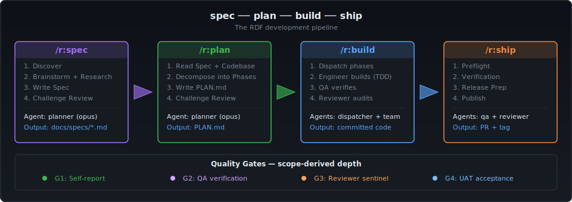

# RDF -- rfxn Development Framework


**Governance-driven AI development for teams that ship to production.**

RDF is a convention governance layer for AI coding agents. It sits between the human and the AI runtime (Claude Code, Gemini CLI, Codex), encoding project conventions, quality gates, and domain expertise into typed agent personas -- so the AI writes code that actually follows your rules.

> **This is not a drop-in framework.** RDF is purpose-built for the rfxn ecosystem and shared as a reference for what disciplined AI-assisted development looks like. The value is the pattern: governance-driven agents, adversarial quality gates, convention inheritance, and context window management.

---

## How It Works

<p align="center">
   plan -> build -> ship" width="100%"/>
</p>

Six universal agents handle every project. Their behavior is shaped by governance files initialized per-project -- not baked into prompts. A QA agent reviewing a bash firewall tool and a QA agent reviewing a Python pipeline follow different rules because their governance files are different, not because they are different agents.

---

## Quick Start

```bash
# 1. Clone
git clone https://github.com/rfxn/rdf.git && cd rdf

# 2. Generate adapter output for your AI tool
bin/rdf generate claude-code          # or: gemini-cli, codex, agents-md, all

# 3. Deploy (symlinks -- regeneration auto-updates)
bin/rdf deploy claude-code            # or: bin/rdf deploy gemini-cli

# 4. Initialize a project with governance
cd /path/to/your/project
/r:init                               # auto-detects project type, suggests profiles
```

That's it. Your AI agent now has project-specific governance, quality gates, and domain expertise.

**Verify:**
```bash
bin/rdf doctor                        # health check: artifacts, drift, sync
```

---

## What Makes RDF Different

### Governance as Code

Every project gets its own governance files -- conventions, verification checks, anti-patterns, and constraints -- generated from profiles matched to the codebase. The AI reads these before every task. No more re-explaining your rules each session.

### Multi-Adapter Delivery

Write content once in tool-agnostic markdown. Generate for any runtime:

| Adapter | Output | Deploy Target |
|---------|--------|---------------|
| **Claude Code** | YAML-frontmattered agents + markdown commands | `~/.claude/` |
| **Gemini CLI** | TOML commands + YAML agents + GEMINI.md | `~/.gemini/` |
| **Codex** | Consolidated AGENTS.md + config.toml | Project root |
| **AGENTS.md** | Cross-tool documentation | Project root |

```bash
bin/rdf generate all                  # builds all four in one pass
```

### Domain Expertise Profiles

Six profiles provide deep, real-world best practices -- not generic checklists. Each profile includes a governance template (~100-150 lines) plus reference docs with expanded examples.

| Profile | Depth | Security Coverage | Reference Docs |
|---------|-------|-------------------|----------------|
| **core** | Commit protocol, verification, dependency management | Secrets, input validation, injection defense (shell/SQL/LLM/HTML) | 3 |
| **shell** | Quoting, portability, error handling, process management | Command injection, TOCTOU races, SUID confusion, temp files | 3 |
| **python** | Typing, packaging, fixtures, async patterns | Deserialization, SSRF, import hijacking, subprocess safety | 3 |
| **frontend** | Components, a11y (WCAG 2.1 AA), CSS methodology, performance | XSS, CSRF, CSP, auth token storage, postMessage | 4 |
| **database** | Schema design, migration safety, query discipline, indexing | SQL injection, least privilege, RLS, connection string security | 4 |
| **go** | Error handling, concurrency, interfaces, modules | Race conditions, TLS config, command execution, deserialization | 3 |

Profiles auto-detect from your codebase (`.sh` files -> shell, `go.mod` -> go, `package.json` with React -> frontend). Project CLAUDE.md always takes precedence over profile defaults.

### Operational Modes

Profiles define *what* the code is. Modes define *how* you work on it right now:

| Mode | Effect |
|------|--------|
| `development` | Default TDD workflow, progressive quality gates |
| `security-assessment` | Threat-model-first, OWASP methodology, security findings are blocking |
| `performance-audit` | Profiling workflow, bottleneck analysis |
| `migration` | Version/platform migration planning |

```bash
/r:mode security                      # switch to security assessment mode
```

Modes are session-scoped overlays. They change how agents think without modifying governance files.

### Adversarial Quality Gates

Every phase can trigger quality gates based on risk and type tags:

| Gate | Agent | Trigger |
|------|-------|---------|
| G1 | Self-report | All phases |
| G2 | QA (rdf-qa) | risk:medium+ |
| G3 | Reviewer sentinel (rdf-reviewer) | risk:high or type:security |
| G4 | UAT (rdf-uat) | type:user-facing |

The reviewer runs 4 adversarial passes: anti-slop, regression, security, performance. Security findings are **blocking** in security mode.

---

## The Pipeline

### Design -> Plan -> Build -> Ship

| Stage | Command | What Happens | Artifact |
|-------|---------|-------------|----------|
| **Design** | `/r:spec` | Discover, brainstorm options, research, write spec, challenge review | `docs/specs/*.md` |
| **Plan** | `/r:plan` | Read spec, decompose into phases with TDD steps, challenge review | `PLAN.md` |
| **Build** | `/r:build [N]` | Dispatcher orchestrates: engineer implements, QA verifies, reviewer audits | Committed code |
| **Ship** | `/r:ship` | Preflight checks, verification, release prep, publish, report | PR + git tag |

Enter at any point. Have a spec already? Start with `/r:plan`. Have a plan? Start with `/r:build`. Each command tells you the next step.

### Audit Pipeline

```bash
/r:audit                              # parallel: 3x reviewer + 1x qa -> AUDIT.md
```

### Agent Roster

| Agent | Model | Role | Tools |
|-------|-------|------|-------|
| **rdf-planner** | opus | Design specs, implementation plans | Full read/write |
| **rdf-dispatcher** | sonnet | Phase orchestration, TDD cycles | Full read/write |
| **rdf-engineer** | opus | Implementation via governance protocol | Full read/write |
| **rdf-qa** | sonnet | Verification gate (read-only) | Read + execute |
| **rdf-reviewer** | opus | Adversarial review -- challenge + sentinel (read-only) | Read + execute |
| **rdf-uat** | sonnet | User acceptance from end-user persona (read-only) | Read + execute |

### Scripts (10)

| Script | Purpose |
|--------|---------|
| context-bar.sh | Status line -- project, branch, phase, model |
| clone-conversation.sh | Fork current conversation to new session |
| half-clone-conversation.sh | Fork recent half of conversation |
| check-context.sh | Context window utilization check |
| setup.sh | First-run environment setup |
| color-preview.sh | Terminal color palette preview |
| test-half-clone.sh | Test harness for half-clone |
| subagent-stop.sh | Capture agent completion events |
| pre-commit-validate.sh | Pre-commit lint + anti-pattern greps |
| post-edit-lint.sh | Post-edit shellcheck on modified files |

---

## Command Reference

### Session Lifecycle

| Command | Purpose |
|---------|---------|
| `/r:init` | Initialize governance for a new or existing project |
| `/r:start` | Session initialization -- reload context, display project health |
| `/r:save` | End-of-session state sync -- PLAN.md, MEMORY.md, session log |
| `/r:mode` | Switch operational mode (development, security, performance, migration) |
| `/r:status` | Project health dashboard -- pipeline position, plan progress, warnings |
| `/r:refresh` | Re-scan codebase and update governance files |
| `/r:sync` | Pull emergency edits from deployed location back to canonical |

### Design -> Ship Pipeline

| Command | Dispatches | Purpose |
|---------|-----------|---------|
| `/r:spec` | -- | Design: discover -> brainstorm -> write spec -> challenge review |
| `/r:plan` | reviewer | Plan: read spec -> decompose into PLAN.md -> challenge review |
| `/r:build [N]` | dispatcher | Execute: TDD cycle per phase with quality gates |
| `/r:verify` | qa | QA verification against diff or scope |
| `/r:test` | uat | User acceptance testing from end-user persona |
| `/r:review` | reviewer | Adversarial review in challenge or sentinel mode |
| `/r:audit` | 3x reviewer + qa | Full codebase audit across all domains |
| `/r:ship` | qa + reviewer | Release: preflight -> verify -> prep -> publish -> report |

### Utilities (14)

| Command | Purpose |
|---------|---------|
| `/r:util:mem-compact` | Archive stale MEMORY.md entries |
| `/r:util:mem-audit` | Fact-check MEMORY.md against live state |
| `/r:util:chg-gen` | Generate changelog from diff/commits |
| `/r:util:chg-dedup` | Deduplicate changelog entries |
| `/r:util:rel-squash` | Release branch squash plan + execution |
| `/r:util:doc-gen` | Generate publication-ready documentation |
| `/r:util:ci-gen` | Generate GitHub Actions CI workflow |
| `/r:util:lib-sync` | Cross-project shared library drift detection |
| `/r:util:lib-release` | Shared library release lifecycle |
| `/r:util:proj-cross` | Cross-project convention drift analysis |
| `/r:util:code-scan` | Structured pattern-class bug finder |
| `/r:util:code-modernize` | Codebase modernization assessment |
| `/r:util:test-dedup` | Find duplicate/overlapping tests |
| `/r:util:test-scope` | Test tier recommendation + impact mapping |

---

## Architecture

### Core Principles

1. **Canonical-first, adapter-delivered.** All content lives as tool-agnostic markdown in `canonical/`. Adapters generate tool-specific output. Develop in canonical, deploy via `rdf generate`.

2. **Governance-driven agents.** Six universal agents shaped by per-project governance files, not baked-in domain knowledge. Same agent, different governance, different behavior.

3. **Profiles are expertise, modes are methodology.** Profiles define *what the code is* (shell, Python, frontend). Modes define *how you work* (development, security assessment). They compose independently.

4. **Not a runtime.** Claude Code / Gemini CLI / Codex IS the runtime. RDF is the governance layer that tells the runtime how to behave.

5. **Convention over configuration.** Project CLAUDE.md > profile defaults > core defaults. The most specific rule always wins.

### Data Flow

```
canonical/          Adapter            Tool Deployment
  agents/*.md  -->  adapter.sh  -->  output/agents/*.md  -->  ~/.claude/agents/
  commands/*.md     (frontmatter      output/commands/*       ~/.claude/commands/
  scripts/*.sh       injection)       output/scripts/*.sh     ~/.claude/scripts/
                                                            (symlinks)
```

**Normal:** Edit `canonical/` -> `rdf generate` -> symlinks auto-update.
**Emergency:** Edit `~/.claude/` -> `rdf sync` -> back to canonical.
**Drift check:** `rdf doctor --scope sync` -> detects divergence.

### Directory Structure

```
rdf/
|-- bin/rdf                             # CLI dispatcher
|-- lib/
|   |-- rdf_common.sh                  # Shared helpers, profile system
|   +-- cmd/                           # Subcommands: generate, profile, init, doctor,
|                                      #   state, refresh, sync, github, deploy
|-- canonical/
|   |-- agents/                        # 6 universal agents (pure markdown)
|   |-- commands/                      # 28 commands (/r: namespace)
|   |-- scripts/                       # 10 hook scripts (bash)
|   +-- reference/                     # Framework docs
|-- profiles/
|   |-- registry.json                  # Machine-readable profile catalog
|   |-- registry.md                    # Human-readable profile catalog
|   |-- detection-rules.md            # Auto-detection signals per profile
|   |-- core/                          # Always active -- commit protocol, security hygiene
|   |-- shell/                         # Bash/shell -- quoting, portability, BATS
|   |-- python/                        # Python -- typing, pytest, packaging
|   |-- frontend/                      # Web -- a11y, performance, CSS methodology
|   |-- database/                      # DB -- schema, migrations, engine-specific refs
|   +-- go/                            # Go -- concurrency, error handling, modules
|-- modes/
|   |-- development/                   # Default TDD workflow
|   |-- security-assessment/           # Threat-model-first assessment
|   |-- performance-audit/             # Profiling and optimization
|   +-- migration/                     # Version/platform migration
|-- adapters/
|   |-- claude-code/                   # CC adapter + metadata + hooks
|   |-- gemini-cli/                    # Gemini CLI adapter (TOML)
|   |-- codex/                         # Codex adapter (AGENTS.md)
|   +-- agents-md/                     # Cross-tool AGENTS.md
|-- state/rdf-state.sh                 # Project state -> JSON (<1s)
+-- reference/                         # Diagrams, architecture docs
```

---

## CLI Reference

```
Usage: rdf <command> [subcommand] [options]

Commands:
  generate   Build tool-specific output from canonical sources
  deploy     Symlink generated output to tool deployment target
  profile    Manage active domain profiles
  init       Initialize projects with governance
  doctor     Check project health and convention drift
  state      Deterministic project state snapshot (JSON)
  refresh    Agent-driven governance and state updates
  sync       Pull deployed edits back to canonical sources
  github     GitHub Issues + Projects integration

Run 'rdf <command> help' for details.
```

| Command | Key Operations |
|---------|----------------|
| `rdf generate <target>` | `claude-code`, `gemini-cli`, `codex`, `agents-md`, `all` |
| `rdf deploy <target>` | Symlink output to `~/.claude/`, `~/.gemini/`, etc. |
| `rdf profile list\|install\|remove\|status` | Manage active profiles with dependency resolution |
| `rdf init <path> [--type] [--tools] [--github]` | Project initialization with governance templates |
| `rdf doctor [--scope] [--all]` | 6 checks: artifacts, drift, memory, plan, github, sync |
| `rdf state [<path>]` | JSON snapshot in <1s -- no LLM calls |
| `rdf refresh [--scope]` | Re-scan codebase, update governance and state files |
| `rdf sync [--dry-run]` | Emergency: pull `~/.claude/` edits back to canonical |
| `rdf github setup\|sync-labels\|ecosystem-init\|ecosystem-add` | GitHub issue model + project boards |

---

## Production Context

RDF governs development of security infrastructure deployed across ~350,000 active servers:

- **APF** (Advanced Policy Firewall) -- network access control and rate limiting
- **LMD** (Linux Malware Detect) -- filesystem malware scanning with daily signature updates
- **BFD** (Brute Force Detection) -- real-time authentication attack detection

Daily check-ins from government (NIST, NOAA, NIH), defense (NATO CCDCOE), universities (Stanford, Harvard), telecom (Deutsche Telekom, Vodafone, Telefonica), and infrastructure providers (AWS, Hetzner, OVHcloud, DigitalOcean) across cPanel, Plesk, and bare-metal environments.

**What goes wrong when code is wrong:** A false positive in LMD quarantines legitimate files on every server that pulls the update. A regression in APF rule parsing locks administrators out of their own servers. A threshold change in BFD floods block lists or stops detecting real attacks. These are security tools -- a regression changes the security posture of hundreds of thousands of machines.

| Metric | Value |
|--------|-------|
| Active servers | ~350,000 |
| Total commits (governed) | 1,686 |
| Production code | 31,176 lines |
| Test code (BATS) | 70,965 lines |
| Test cases | 5,764 |
| Governance framework | 14,204 lines |
| Net code churn | +271K / -111K lines |

### Project Ecosystem

```
PRODUCTS                    SHARED LIBRARIES
+-----------------+         +-------------+
| APF   2.0.2     |---------| tlog_lib    | structured logging
| BFD   2.0.2     |---------| alert_lib   | Slack/email alerts
| LMD   2.0.1     |---------| elog_lib    | event logging
+-----------------+         | pkg_lib     | package management
+-----------------+         | geoip_lib   | IP geolocation
| Sigforge  1.2.0 |         | batsman     | BATS test infra
| geoscope  1.1.0 |         +-------------+
+-----------------+
```

All projects share: batsman test infrastructure, parent CLAUDE.md conventions, RDF governance pipeline, GitHub label taxonomy.

---

## Philosophy

**Governance overhead is proportional to blast radius.** Security tools running on 350,000 servers need more quality gates than a weekend project. RDF scales governance to risk.

**Agents are context buffers, not general-purpose.** A QA agent loaded with only the diff, test results, and verification protocol catches issues that a general-purpose agent with full context would miss. Narrow context, deep expertise.

**Convention inheritance beats documentation.** Projects inherit conventions from profiles and parent governance files. The AI reads them automatically. No one needs to remember to brief the model on project rules.

**Trust is earned with evidence, not claims.** Every quality gate requires specific evidence -- grep output, test results, commit hashes. "I checked and it's fine" is not acceptable.

---

## Extending RDF

<details>
<summary><strong>Add a Command</strong></summary>

1. Create `canonical/commands/<name>.md` (pure markdown, no frontmatter)
2. `rdf generate claude-code` to deploy
3. Add to command table in README

Commands use `/r:<name>` (lifecycle) or `/r:util:<subject>` (utility).
</details>

<details>
<summary><strong>Add an Agent</strong></summary>

1. Create `canonical/agents/<name>.md`
2. Add metadata to `adapters/claude-code/agent-meta.json`:
   ```json
   "<name>": {
     "name": "rdf-<name>",
     "description": "...",
     "tools": ["Bash", "Read", "Glob", "Grep"],
     "model": "sonnet"
   }
   ```
3. `rdf generate claude-code` and verify frontmatter
</details>

<details>
<summary><strong>Add a Profile</strong></summary>

1. Add entry to `profiles/registry.json` and `profiles/registry.md`
2. Create `profiles/<name>/governance-template.md` + `reference/`
3. Add detection rules to `profiles/detection-rules.md`
4. `rdf profile install <name>` then `rdf generate claude-code`
</details>

<details>
<summary><strong>Add an Adapter</strong></summary>

1. Create `adapters/<tool>/adapter.sh` implementing `<prefix>_generate_all()`
2. Add case branch in `lib/cmd/generate.sh`
3. Study `adapters/claude-code/adapter.sh` as reference

Contract: read from `${RDF_CANONICAL}`, write to adapter `output/`. Never modify canonical.
</details>

<details>
<summary><strong>Onboard a Project</strong></summary>

```bash
rdf init /path/to/project --type shell --tools claude-code --github
```

Creates CLAUDE.md (from governance template), MEMORY.md, `.git/info/exclude`, and optionally GitHub labels + project board.
</details>

---

## Documentation

| Document | Purpose |
|----------|---------|
| **[RDF.md](RDF.md)** | Architecture scope, risk analysis, directory structure |
| **[WORKFORCE.md](WORKFORCE.md)** | Agent workforce, pipeline diagrams, gate details |
| **[reference/diagrams.md](reference/diagrams.md)** | Mermaid diagrams: pipeline, architecture, ecosystem |
| **[CHANGELOG](CHANGELOG)** | Development history |
| **[CHANGELOG.RELEASE](CHANGELOG.RELEASE)** | Release notes (3.0.0) |

---

**6 agents -- 28 commands -- 10 scripts -- 6 profiles -- 4 adapters -- 4 modes**

(C) 2026 R-fx Networks <proj@rfxn.com>
