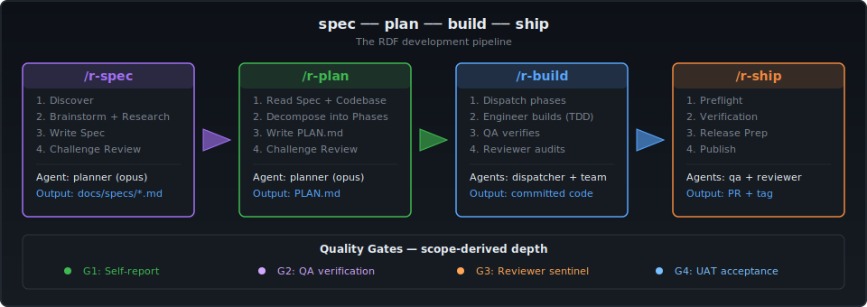

# RDF — rfxn Development Framework
{: .fs-8 }

**Governance-driven AI development for teams that ship to production.**
{: .fs-5 .fw-300 }

RDF is a convention governance layer for AI coding agents. It sits
between you and the AI runtime (Claude Code, Codex, Antigravity CLI),
encoding project conventions, quality gates, and domain expertise into
typed agent personas — so the AI writes code that actually follows your
rules.

[](https://github.com/rfxn/rdf/actions/workflows/ci.yml)
[](https://github.com/rfxn/rdf/releases/latest)
[](https://github.com/rfxn/rdf/blob/main/LICENSE)

**6 agents · 37 commands · 11 profiles · 6 adapters · 7 modes**

[Quickstart — 5 minutes](quickstart){: .btn .btn-primary .fs-5 .mb-4 .mr-2 }
[View on GitHub](https://github.com/rfxn/rdf){: .btn .fs-5 .mb-4 }

---


*Real recorded session — install RDF, initialize a plain Flask project,
verify health. 42 seconds, no edits, ends at `0 FAIL`.*

## Install

**As a Claude Code plugin** (one command, commands namespaced `/rdf:r-*`):

```
/plugin marketplace add rfxn/rdf
/plugin install rdf@rdf
```

**Or symlink deploy** (contributor mode, bare `/r-*` commands):

```bash
git clone https://github.com/rfxn/rdf.git ~/rdf && cd ~/rdf
bin/rdf generate claude-code && bin/rdf deploy claude-code
bin/rdf init ~/projects/my-app     # auto-detects your stack
```

Hooks and the status line require `jq` on your PATH in both modes.
Context cost is published and CI-guarded: the default deploy adds ~0.1K
always-loaded tokens per session (~2.1K with opt-in scoped rules, ~0.7K for
`rdf-lite`). Full walkthrough with real output: [Quickstart](quickstart).

## The pipeline



Four commands take a change from idea to release — `/r-spec` (research +
adversarial design review), `/r-plan` (execution-grade decomposition),
`/r-build` (TDD with quality gates), `/r-ship` (preflight → publish).
Small change? Skip the pipeline — governance applies to normal sessions
too.

## Why RDF

| Principle | What it means |
|-----------|---------------|
| **Governance as code** | Conventions live in versioned files the AI reads every session — not in your head or a wiki |
| **Adversarial quality gates** | Reviewer agents challenge specs before implementation and audit code after it, with scope-derived depth |
| **Convention inheritance** | Workspace → project → profile layering; one edit propagates everywhere |
| **Multi-adapter** | Author governance once; deploy to Claude Code (symlink or plugin), Gemini CLI, Codex, or plain AGENTS.md |

## Proven on production infrastructure

RDF governs the development of security tooling running on
**~350,000 servers** (APF, LMD, BFD). Measured across the RDF era
(March–July 2026, derived from session logs and git history):

- **518 governed sessions** across 30+ projects at a sustained
  **~4.3 sessions/day**, landing **2,513 git-verified commits**
- **Three major releases shipped under governance** — LMD 2.0, APF 2.0,
  BFD 2.0 — plus **19 RDF releases in 19 weeks**
- **6,871 BATS tests** across 13 governed repos, all CI-runnable
- Every release backed by committed design specs (25) and implementation
  plans (22) — we design in the open:
  [spec archive](https://github.com/rfxn/rdf/tree/main/docs/specs)

## Docs

- **[Quickstart — your repo in 5 minutes](quickstart)**
- [Demo walkthrough — a real production change, spec to ship](demo-walkthrough)
- [Full command reference (README)](https://github.com/rfxn/rdf#4-usage)
- [Roadmap](https://github.com/rfxn/rdf/blob/main/ROADMAP.md)

## Get involved

[Issues](https://github.com/rfxn/rdf/issues) ·
[Discussions](https://github.com/rfxn/rdf/discussions) ·
[Contributing](https://github.com/rfxn/rdf/blob/main/CONTRIBUTING.md) ·
[Security policy](https://github.com/rfxn/rdf/blob/main/SECURITY.md) ·
[Privacy policy](privacy)
