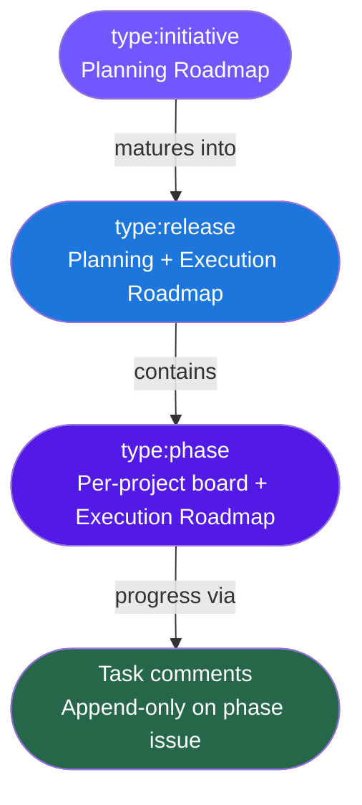
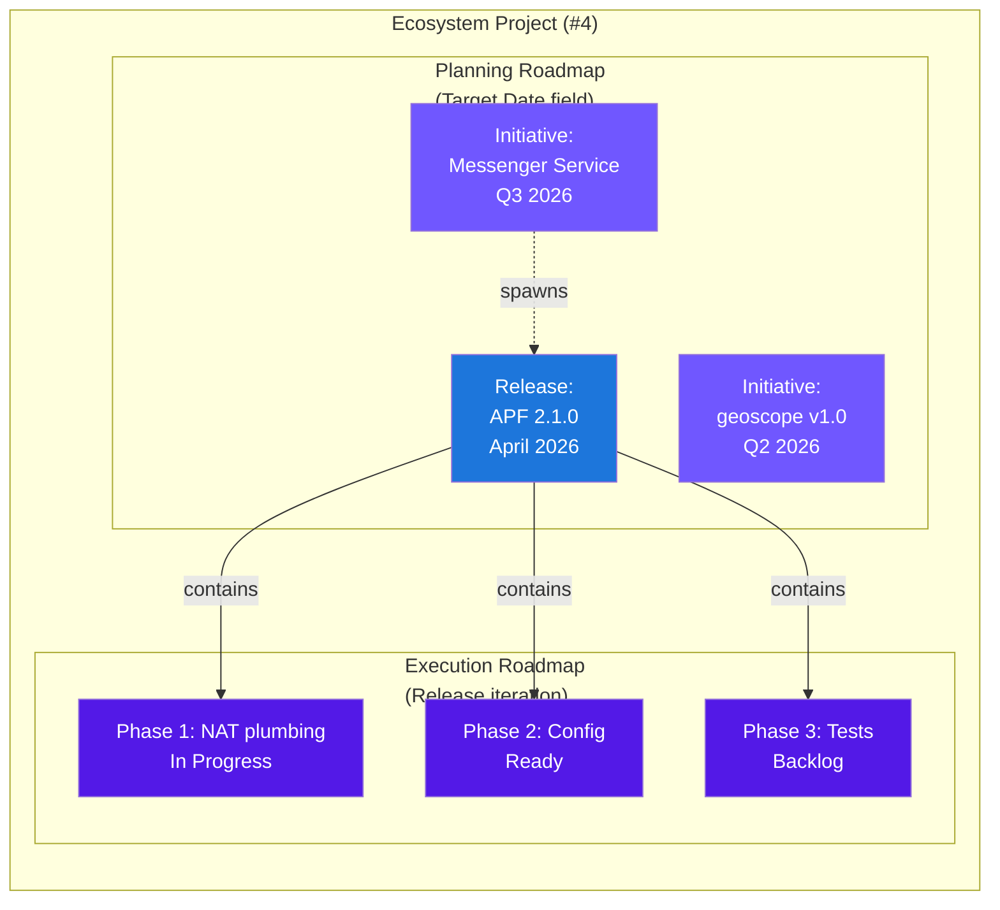

# GitHub Issue Model v2 Implementation Plan

> **For agentic workers:** REQUIRED: Use superpowers:subagent-driven-development (if subagents available) or superpowers:executing-plans to implement this plan. Steps use checkbox (`- [ ]`) syntax for tracking.

**Goal:** Migrate from per-task GitHub issue tracking to phase-level tracking with roadmap planning, reducing API calls by ~72% and providing cross-project roadmap visibility.

**Architecture:** Update `rdf github` CLI to support new labels and ecosystem fields. Update all canonical agent/command files to use phase-level issue comments instead of task issue management. Migrate existing RDF project boards. Refresh all published documentation and diagrams.

**Tech Stack:** bash (rdf CLI), GitHub Projects v2 API via `gh`, Mermaid diagrams, markdown

**Spec:** `rdf/docs/specs/2026-03-16-github-issue-model-v2-design.md`

---

## Chunk 1: GitHub Infrastructure — Labels, Fields, CLI, Migration

### Task 1: Add v2 labels to `lib/cmd/github.sh`

**Files:**
- Modify: `rdf/lib/cmd/github.sh:29-50`

- [ ] **Step 1: Add `type:initiative` and `type:release` to `_LABEL_TAXONOMY` array**

After line 36 (`type:debt`), add:

```bash
    "type:initiative;7057FF;Roadmap planning item — directional time-boxed"
    "type:release;1D76DB;Versioned release tracking — parent for phase issues"
```

- [ ] **Step 2: Verify syntax**

Run: `bash -n rdf/lib/cmd/github.sh`
Expected: no output (clean parse)

- [ ] **Step 3: Verify label count**

Run: `grep -c 'type:\|domain:\|P[123]:\|blocked\|needs-\|release-gate' rdf/lib/cmd/github.sh`
Expected: 21 (was 19, +2 new labels)

---

### Task 2: Update ecosystem project setup for v2

**Files:**
- Modify: `rdf/lib/cmd/github.sh:170-213`

- [ ] **Step 1: Fix `_github_ecosystem_init()` to update fields on existing projects**

The function currently returns early at line 187 if the project exists. This
prevents field updates on the already-created ecosystem project (#4). Restructure
so that field creation runs regardless:

```bash
_github_ecosystem_init() {
    local org="rfxn"
    while [[ $# -gt 0 ]]; do
        case "$1" in
            --org) org="$2"; shift 2 ;;
            *) rdf_die "unknown option: $1" ;;
        esac
    done

    rdf_require_bin gh

    local title="rfxn Ecosystem"
    local existing
    existing="$(gh project list --owner "$org" --format json 2>/dev/null | jq -r ".projects[] | select(.title == \"${title}\") | .number" || echo "")"

    local project_number
    if [[ -n "$existing" ]]; then
        rdf_log "ecosystem project already exists: #${existing}"
        project_number="$existing"
    else
        project_number="$(gh project create --title "$title" --owner "$org" --format json 2>/dev/null | jq -r '.number')"
        rdf_log "created ecosystem project #${project_number}"
    fi

    # Ecosystem-specific fields (idempotent — field-create fails silently if exists)
    local eco_fields=(
        "Status;SINGLE_SELECT;Backlog,Ready,In Progress,In Review,Done"
        "Project;SINGLE_SELECT;RDF,APF,BFD,LMD,Sigforge,Libraries,geoscope"
        "Priority;SINGLE_SELECT;P1,P2,P3"
        "Effort;SINGLE_SELECT;XS,S,M,L,XL"
        "Target Date;DATE;"
    )

    for entry in "${eco_fields[@]}"; do
        IFS=';' read -r name type options <<< "$entry"
        if [[ "$type" == "SINGLE_SELECT" ]]; then
            local opts_json
            opts_json="$(echo "$options" | tr ',' '\n' | jq -R . | jq -sc 'map({name: .})')"
            gh project field-create "$project_number" --owner "$org" \
                --name "$name" --data-type "SINGLE_SELECT" \
                --single-select-options "$opts_json" 2>/dev/null || \
                rdf_log "  field exists or error: ${name}"
        else
            gh project field-create "$project_number" --owner "$org" \
                --name "$name" --data-type "$type" 2>/dev/null || \
                rdf_log "  field exists or error: ${name}"
        fi
    done

    rdf_log "ecosystem project setup complete"
    rdf_log "  Ecosystem views (web UI): Kanban, Cross-Project Board, Planning Roadmap (Target Date), Execution Roadmap (Release), Release Gate"
}
```

Key changes: removed early return, added `geoscope` to Project options, added
`Target Date;DATE;` entry, added type-dispatch `if/else` (matching `_github_create_project()`
pattern) so DATE fields are created with `--data-type DATE` not SINGLE_SELECT.

- [ ] **Step 2: Verify syntax**

Run: `bash -n rdf/lib/cmd/github.sh`
Expected: no output (clean parse)

- [ ] **Step 3: Update view creation note in `_github_create_project()`**

Change line 119:

```bash
    rdf_log "  Required views: Kanban (default), Phase Board, Active Work, Roadmap, Backlog"
```

to:

```bash
    rdf_log "  Required views: Kanban (default), Phase Board, Active Work, Roadmap, Backlog"
    rdf_log "  Ecosystem views: Kanban, Cross-Project Board, Planning Roadmap (Target Date), Execution Roadmap (Release), Release Gate"
```

---

### Task 3: Update `docs/plans/github-project-ids.md`

**Files:**
- Modify: `rdf/docs/plans/github-project-ids.md`

- [ ] **Step 1: Add Target Date field ID placeholder**

After the Assignee Role section, add:

```markdown
## Target Date Field (Ecosystem Project #4)
Field ID: `(to be populated after rdf github ecosystem-init)`

Type: DATE — no options. Set to end-of-quarter for initiatives (e.g., 2026-06-30 for Q2).
```

- [ ] **Step 2: Add new labels reference**

Add after the existing content:

```markdown
## v2 Labels (added 2026-03-16)

| Label | Color | Use |
|-------|-------|-----|
| `type:initiative` | #7057FF | Roadmap planning — directional, time-boxed |
| `type:release` | #1D76DB | Versioned release — parent for phase issues |
```

- [ ] **Step 3: Add note about deprecated task-level item ID map**

Add a note above the Phase 2 task-to-item map:

```markdown
> **Note:** Task-level item IDs below are historical (v1 model). v2 tracks
> phase issues only. Task items have been removed from project boards.
```

---

### Task 4: Sync labels to all rfxn repos

**Files:** None (GitHub API operations only)

- [ ] **Step 1: Sync labels**

Run:
```bash
cd /root/admin/work/proj/rdf && bin/rdf github sync-labels --org rfxn
```

Expected: Each repo shows "created: type:initiative" and "created: type:release".
Existing labels show "exists: <name>".

- [ ] **Step 2: Verify on one repo**

Run:
```bash
gh label list --repo rfxn/rdf --json name --jq '.[].name' | grep -E 'type:(initiative|release)'
```

Expected:
```
type:initiative
type:release
```

---

### Task 5: Remove task-level items from RDF Dev project board

**Files:** None (GitHub API operations only)

- [ ] **Step 1: List task-level items on RDF Dev board (#3)**

Run:
```bash
gh project item-list 3 --owner rfxn --format json --limit 200 | \
  jq -r '.items[] | select(.labels[]?.name == "type:task") | "\(.id)\t\(.content.number)\t\(.content.title)"'
```

Record the output — these are the items to remove.

- [ ] **Step 2: Remove each task-level item**

For each item ID from step 1:
```bash
gh project item-delete 3 --owner rfxn --id <ITEM_ID>
```

- [ ] **Step 3: Verify phase issues remain**

Run:
```bash
gh project item-list 3 --owner rfxn --format json --limit 50 | \
  jq -r '.items[] | "\(.content.number)\t\(.labels[].name // "no-label")\t\(.content.title)"' | head -20
```

Expected: Only `type:phase` labeled items remain (8 phase + 1 master).

---

### Task 6: Remove task-level items from Ecosystem project board (#4)

**Files:** None (GitHub API operations only)

- [ ] **Step 1: List task-level items on Ecosystem board**

Run:
```bash
gh project item-list 4 --owner rfxn --format json --limit 200 | \
  jq -r '.items[] | select(.labels[]?.name == "type:task") | "\(.id)\t\(.content.number)"'
```

- [ ] **Step 2: Remove each task-level item (if any)**

Same pattern as Task 5 Step 2.

- [ ] **Step 3: Add Target Date field to ecosystem project**

Run:
```bash
gh project field-create 4 --owner rfxn --name "Target Date" --data-type DATE
```

Record the field ID returned — update `github-project-ids.md` with actual value.

---

### Task 7: Relabel RDF master issue as type:release

**Files:** None (GitHub API operations only)

- [ ] **Step 1: Identify the RDF 2.0.0 master issue**

Run:
```bash
gh issue list --repo rfxn/rdf --label "type:phase" --state all --json number,title | \
  jq '.[] | select(.title | test("2\\.0\\.0|master|release"; "i"))'
```

- [ ] **Step 2: Relabel from type:phase to type:release**

```bash
gh issue edit <NUMBER> --repo rfxn/rdf --remove-label "type:phase" --add-label "type:release"
```

- [ ] **Step 3: Check for master issues in other repos**

```bash
for repo in rfxn/advanced-policy-firewall rfxn/brute-force-detection rfxn/linux-malware-detect; do
  echo "=== $repo ==="
  gh issue list --repo "$repo" --label "type:phase" --state all --json number,title 2>/dev/null | \
    jq '.[] | select(.title | test("master|release|[0-9]+\\.[0-9]+\\.[0-9]+"; "i"))'
done
```

If any master issues found, relabel them as `type:release` using the same pattern as Step 2.

- [ ] **Step 4: Migrate issue #22 (P3 backlog debt)**

```bash
gh issue view 22 --repo rfxn/rdf --json title,body,labels
```

If still open, either:
- Add a comment linking it to the relevant future phase, then close it
- Or fold its content into the next release's planning

---

### Task 8: Seed initiative issues

**Files:** None (GitHub API operations only)

- [ ] **Step 1: Create Messenger Service initiative**

```bash
gh issue create --repo rfxn/brute-force-detection \
  --title "Messenger Service" \
  --label "type:initiative" \
  --body "$(cat <<'EOF'
## Messenger Service

### Vision
Unified notification and alerting service for BFD, with NAT redirect plumbing provided by APF. Replaces ad-hoc email/alert dispatch with a configurable messenger pipeline.

### Scope
- Project(s): BFD (primary), APF (NAT redirect)
- Key deliverables:
  - Messenger service daemon in BFD
  - NAT/redirect plumbing (G6) in APF
  - MESSENGER config integration

### Target Window
Q3 2026

### Dependencies
- Requires: APF G6 NAT redirect implementation
- Enables: Unified alerting across BFD detection events

### Status
Planning

### Related
- Spec: See PLAN-csf.md for architectural notes
- Releases: (to be created)
EOF
)"
```

- [ ] **Step 2: Create geoscope v1.0 initiative**

```bash
gh issue create --repo rfxn/geoscope \
  --title "geoscope v1.0 — IP Geolocation Data Pipeline" \
  --label "type:initiative" \
  --body "$(cat <<'EOF'
## geoscope v1.0 — IP Geolocation Data Pipeline

### Vision
Standalone Python pipeline that ingests RIR delegations, RPSL sub-allocations, and BGP route tables into SQLite. Replaces geoip_lib dependency on ipverse/ipdeny.

### Scope
- Project(s): geoscope (standalone)
- Key deliverables:
  - RIR delegation parser + RPSL sub-allocation ingestion
  - BGP route table integration (RouteViews/RIPE RIS)
  - SQLite merge with RPSL > RIR > BGP precedence
  - CIDR-per-country export (backwards-compatible with geoip_lib)

### Target Window
Q2 2026

### Dependencies
- Requires: None
- Enables: geoip_lib v2.0 migration to geoscope backend

### Status
Specced

### Related
- Spec: docs/superpowers/specs/2026-03-16-geoscope-design.md
- Plan: docs/superpowers/plans/2026-03-16-geoscope.md
- Releases: (to be created)
EOF
)"
```

- [ ] **Step 3: Create CSF Migration initiative**

```bash
gh issue create --repo rfxn/advanced-policy-firewall \
  --title "CSF Migration" \
  --label "type:initiative" \
  --body "$(cat <<'EOF'
## CSF Migration

### Vision
Migrate CSF (ConfigServer Security & Firewall) users to APF with equivalent feature parity and configuration compatibility.

### Scope
- Project(s): APF
- Key deliverables:
  - CSF configuration import/mapping
  - Feature parity assessment and gap closure
  - Migration tooling and documentation

### Target Window
TBD

### Dependencies
- Requires: APF 2.0.2 stable
- Enables: CSF user migration path

### Status
Planning

### Related
- Spec: PLAN-csf-migration.md
- Releases: (to be created)
EOF
)"
```

- [ ] **Step 4: Add initiatives to ecosystem project**

For each initiative issue URL created above:
```bash
gh project item-add 4 --owner rfxn --url <ISSUE_URL>
```

Then set fields on each item:
- Set **Project** field to the appropriate project (BFD, geoscope, APF)
- Set **Target Date** on Messenger Service to 2026-09-30
- Set **Target Date** on geoscope to 2026-06-30
- Leave CSF Migration Target Date empty (no roadmap position until dated)
- Set **Status** to Backlog for Planning items, Ready for Specced items

---

### Task 9: Commit CLI + docs changes

**Files:**
- `rdf/lib/cmd/github.sh`
- `rdf/docs/plans/github-project-ids.md`

- [ ] **Step 1: Verify all changes**

```bash
bash -n rdf/lib/cmd/github.sh
shellcheck rdf/lib/cmd/github.sh
```

- [ ] **Step 2: Commit**

```bash
git add rdf/lib/cmd/github.sh rdf/docs/plans/github-project-ids.md
git commit -m "$(cat <<'EOF'
GitHub issue model v2 — CLI and project infrastructure

[New] type:initiative and type:release labels in label taxonomy
[New] Target Date field (DATE) in ecosystem project setup
[New] geoscope added to ecosystem Project field options
[Change] View creation notes updated for v2 two-roadmap model
[Change] github-project-ids.md updated with v2 labels and deprecation note
EOF
)"
```

---

## Chunk 2: Canonical Agent + Command Updates

### Task 10: Update `canonical/commands/mgr.md` — phase-level issue management

**Files:**
- Modify: `rdf/canonical/commands/mgr.md`

- [ ] **Step 1: Read current file and assess GitHub issue content**

The mgr.md command currently has NO explicit GitHub issue management sections
(task-issue workflow lives in `feedback_github_rituals.md` memory, not canonical).
This task ADDS a new GitHub integration section, not replaces existing content.

- [ ] **Step 2: Add new GitHub issue management section**

Add a section covering the v2 phase-level workflow:
- Create ONE phase issue per phase (body = plan + tasks + acceptance criteria)
- Create ONE release issue per release (`type:release`)
- NO task-level issues
- Post a comment on the phase issue when each task completes

Update the issue creation workflow to match spec Section 4.1:
```
Plan approved → Create phase issue → Add to per-project board + ecosystem project
→ Set fields: Phase, Status=Ready, Effort, Assignee Role → Dispatch agent
```

- [ ] **Step 3: Add initiative awareness**

Add instructions for the EM to:
- Check for existing `type:initiative` issues when planning new work
- Link release issues to their parent initiative
- Update initiative status (body + board) when releases spawn or complete

- [ ] **Step 4: Update board reading instructions**

Change from reading task-level items to reading phase-level items:
- Read phase issues from per-project board for execution status
- Read initiatives from ecosystem board for roadmap context
- No task-level items on any board

- [ ] **Step 5: Update comment format instructions**

Add the v2 task-completion comment format:
```markdown
**Task N.M complete** — <one-line summary>

Files: <changed files>
Commit: <hash> (Ref #<phase-issue>)
```

---

### Task 11: Update `canonical/commands/sys-eng.md` — comment-based progress

**Files:**
- Modify: `rdf/canonical/commands/sys-eng.md`

- [ ] **Step 1: Read current file and locate commit reference and result reporting sections**

- [ ] **Step 2: Add phase issue commit reference requirement**

The sys-eng.md command currently has no GitHub issue references in commit
examples. Add to the commit/report sections:
```
Reference the phase issue in all commit messages: Ref #<phase-issue>
Multiple commits per phase issue is expected.
```

- [ ] **Step 3: Add task-completion comment step**

After each task completion (within the 7-step protocol), add:
```
Post comment on phase issue:
  gh issue comment <phase-issue-number> --repo <repo> --body "**Task N.M complete** — <summary>"
```

This goes in the Step 7 (Report) section or as a sub-step after Step 6 (Commit).

- [ ] **Step 4: Remove any task-issue management instructions**

Remove or replace any instructions about:
- Setting Status fields on task issues
- Closing task issues
- Creating task issues

---

### Task 12: Update `canonical/commands/sys-qa.md` — phase issue comments

**Files:**
- Modify: `rdf/canonical/commands/sys-qa.md`

- [ ] **Step 1: Read current file and locate verdict/findings output sections**

- [ ] **Step 2: Add phase issue comment for QA verdicts**

After QA writes the verdict file, add:
```
Post QA verdict as comment on phase issue:
  gh issue comment <phase-issue-number> --repo <repo> --body "**QA Verdict: <APPROVED|CHANGES_REQUESTED>** — <summary>"
```

- [ ] **Step 3: Remove any task-issue references**

Replace any `type:task` references with `type:phase`.

---

### Task 13: Update `canonical/agents/sys-sentinel.md` — phase issue findings

**Files:**
- Modify: `rdf/canonical/agents/sys-sentinel.md`

- [ ] **Step 1: Read current file**

- [ ] **Step 2: Add instruction to post findings as phase issue comment**

Add to the workflow section:
```
After writing sentinel-N.md, post a summary comment on the phase issue:
  gh issue comment <phase-issue-number> --repo <repo> --body "**Sentinel Review: <PASS|PASS WITH NOTES|FAIL>** — <N> findings (<N> MUST-FIX, <N> SHOULD-FIX)"
```

---

### Task 14: Update `canonical/agents/mgr.md` — initiative awareness

**Files:**
- Modify: `rdf/canonical/agents/mgr.md`

- [ ] **Step 1: Read current file**

- [ ] **Step 2: Add GitHub-native project management capability**

Add to the agent description:
- Reads phase issues from per-project board for execution status
- Reads initiatives from ecosystem board for roadmap context
- Creates phase issues (not task issues) when dispatching work
- Posts task-completion comments as proxy when agent reports complete
- Manages initiative lifecycle: Planning → Specced → Executing → Complete

---

### Task 15: Update `canonical/agents/sys-eng.md` — phase commit references

**Files:**
- Modify: `rdf/canonical/agents/sys-eng.md`

- [ ] **Step 1: Read current file**

- [ ] **Step 2: Add phase issue reference requirement**

Add to evidence requirements:
- Commit messages must include `Ref #<phase-issue>`
- Post task-completion comment on phase issue after each commit

---

### Task 16: Update `canonical/commands/refresh.md` — remove task issue sync

**Files:**
- Modify: `rdf/canonical/commands/refresh.md:80-95`

- [ ] **Step 1: Rewrite Section 4 (Refresh GitHub)**

Replace lines 88-95 with:

```markdown
Or if the `rdf` CLI is not available, use `gh` directly:

- List phase issues: `gh issue list --label "type:phase" --state all --json number,title,state`
- List release issues: `gh issue list --label "type:release" --state all --json number,title,state`
- List initiative issues: `gh issue list --label "type:initiative" --state all --json number,title,state`
- Cross-reference phase issues with PLAN.md statuses
- Close phase issues whose phases are COMPLETE in PLAN.md
- Reopen phase issues whose phases are not COMPLETE but are CLOSED on GitHub
- Update initiative body Status if all child releases are complete
- Report mismatches resolved
```

---

### Task 17: Update release commands

**Files:**
- Modify: `rdf/canonical/commands/rel-prep.md`
- Modify: `rdf/canonical/commands/rel-ship.md`
- Modify: `rdf/canonical/commands/rel-merge.md`

- [ ] **Step 1: Read all three files and locate GitHub issue references**

- [ ] **Step 2: Update `rel-prep.md`**

- Release issue creation uses `type:release` label (not `type:phase` for master)
- Link to parent initiative if applicable
- Use the release issue template from spec Section 3.5

- [ ] **Step 3: Update `rel-ship.md`**

Note: `rel-ship.md` is a Codex PR triage/ship command. Read it first to confirm
whether it references task-level issues. If it only references PRs (not task issues),
the changes may be limited to ensuring phase issue references in commit messages.

- Phase issue closure happens per-phase (not per-task)
- After all phases closed, close the release issue
- Update parent initiative status if this was the last release

- [ ] **Step 4: Update `rel-merge.md`**

- Phase transition references use phase issues only
- No task-issue references in merge commit messages

---

### Task 17b: Update audit commands — phase issue references

**Files:**
- Modify: `rdf/canonical/commands/audit-context.md`

- [ ] **Step 1: Read `audit-context.md` and grep for task-issue references**

```bash
grep -n 'type:task\|task.issue\|task issue' rdf/canonical/commands/audit-context.md
```

- [ ] **Step 2: Replace any task-issue references with phase-issue references**

If findings reference `type:task` issues for creation or linking, change to
`type:phase` phase issues. Audit findings that become GitHub issues should use
`type:audit-finding` (unchanged) but reference the parent phase issue, not task issues.

---

### Task 17c: Update WORKFORCE.md — agent GitHub responsibilities

**Files:**
- Modify: `rdf/WORKFORCE.md`

- [ ] **Step 1: Read current WORKFORCE.md and locate delegation flow / GitHub sections**

- [ ] **Step 2: Update agent responsibilities**

- EM/mgr: creates phase issues (not task issues), manages initiative lifecycle
- SE: posts task-completion comments on phase issues, references phase issues in commits
- QA: posts verdicts as phase issue comments
- Sentinel: posts findings as phase issue comments
- Add initiative lifecycle management to EM responsibilities

---

### Task 17d: Review profile governance files

**Files:**
- Read: `rdf/profiles/core/governance.md`
- Read: `rdf/profiles/systems-engineering/governance.md`
- Read: `rdf/profiles/security/governance.md`
- Read: `rdf/profiles/frontend/governance.md`

- [ ] **Step 1: Grep all four governance files for GitHub/issue references**

```bash
grep -n 'type:task\|task.issue\|GitHub.*issue\|issue.*lifecycle' \
  rdf/profiles/*/governance.md
```

- [ ] **Step 2: Update any stale references**

If any governance file references per-task issue creation or task-level workflow,
update to v2 phase-level model. If no GitHub references exist, no changes needed.

---

### Task 18: Commit canonical updates

- [ ] **Step 1: Run `rdf generate claude-code` to verify generation**

```bash
cd /root/admin/work/proj/rdf && bin/rdf generate claude-code
```

Expected: Clean generation with no errors. Verify output files match canonical.

- [ ] **Step 2: Commit**

```bash
git add rdf/canonical/commands/mgr.md rdf/canonical/commands/sys-eng.md \
  rdf/canonical/commands/sys-qa.md rdf/canonical/commands/refresh.md \
  rdf/canonical/commands/rel-prep.md rdf/canonical/commands/rel-ship.md \
  rdf/canonical/commands/rel-merge.md rdf/canonical/commands/audit-context.md \
  rdf/canonical/agents/mgr.md rdf/canonical/agents/sys-eng.md \
  rdf/canonical/agents/sys-sentinel.md \
  rdf/WORKFORCE.md
# Only add governance files if they were modified:
git diff --name-only rdf/profiles/*/governance.md | xargs -r git add
git commit -m "$(cat <<'EOF'
v2 issue model — canonical agent and command updates

[Change] mgr command: phase-level issue management, initiative awareness
[Change] sys-eng command: task-completion comments, phase issue commit refs
[Change] sys-qa command: QA verdicts posted as phase issue comments
[Change] refresh command: removed task issue sync, added initiative sync
[Change] rel-prep/rel-ship/rel-merge: type:release labels, initiative links
[Change] audit-context: findings reference phase issues
[Change] mgr agent: initiative lifecycle, ecosystem board reading
[Change] sys-eng agent: phase issue reference requirement
[Change] sys-sentinel agent: findings posted as phase issue comments
[Change] WORKFORCE.md: agent GitHub responsibilities updated for v2
EOF
)"
```

---

## Chunk 3: Documentation, Diagrams, Memory

### Task 19: Update `reference/diagrams.md`

**Files:**
- Modify: `rdf/reference/diagrams.md`

- [ ] **Step 1: Add new Diagram 9 — Issue Hierarchy**

After the existing Diagram 8 (File-Based Handoff), add:



- [ ] **Step 2: Add new Diagram 10 — Two-Horizon Roadmap**



- [ ] **Step 3: Update Diagram 7 (Project Ecosystem)**

- Remove `OW[Overwatch 1.5\nDashboard]` (project is DEAD)
- Add `Geo[geoscope 0.1.0\nGeoIP Pipeline]`
- Update version numbers to current: APF 2.0.2, BFD 2.0.1, LMD 2.0.1, Sigforge 1.1.3
- Update `pkg[pkg_lib v1.0.2]` to `pkg[pkg_lib v1.0.4]`
- Add `geoip[geoip_lib v1.0.2]` and `pkg` connections

- [ ] **Step 4: Update Diagram 8 (File-Based Handoff)**

Add a note or annotation showing that SE posts task-completion comments on the
phase issue after each commit step. This can be an additional message in the
sequence diagram:

```
SE-->>GitHub: gh issue comment (task N.M complete)
```

---

### Task 20: Update `README.md`

**Files:**
- Modify: `rdf/README.md`

- [ ] **Step 1: Read current README and locate GitHub integration section**

- [ ] **Step 2: Update GitHub section to reflect v2 model**

Replace any per-task issue description with:
- Phase-level tracking (1 issue per phase, not per task)
- Initiative issues for roadmap planning
- Release issues for version tracking
- Two-horizon roadmap (Planning + Execution)
- Task progress via comments, not separate issues

- [ ] **Step 3: Add issue hierarchy summary**

```
Initiative (type:initiative)  → planning horizon
  └─ Release (type:release)   → committed version
       └─ Phase (type:phase)  → execution unit
            └─ Tasks (comments) → progress trail
```

---

### Task 21: Update `RDF.md`

**Files:**
- Modify: `rdf/RDF.md`

- [ ] **Step 1: Read current file and locate project management section**

- [ ] **Step 2: Update architecture description**

Replace per-task issue references with v2 model:
- Phase-level GitHub issues
- Initiative lifecycle (Planning → Specced → Executing → Complete)
- Two-roadmap ecosystem view
- Reference spec: `docs/specs/2026-03-16-github-issue-model-v2-design.md`

---

### Task 22: Add superseded-by note to v1 spec

**Files:**
- Modify: `rdf/docs/specs/2026-03-16-rdf-2.0-architecture-design.md`

- [ ] **Step 1: Add note at the top of Section 5**

Before Section 5 ("GitHub Integration"), add:

```markdown
> **Note (2026-03-16):** The issue granularity model, workflow, and ecosystem
> views in this section have been superseded by
> `docs/specs/2026-03-16-github-issue-model-v2-design.md`. Labels, custom
> fields, and project setup remain authoritative here.
```

---

### Task 23: Update `feedback_github_rituals.md` memory

**Files:**
- Modify: `/root/.claude/projects/-root-admin-work-proj/memory/feedback_github_rituals.md`

- [ ] **Step 1: Rewrite for v2 workflow**

Replace the full content with:

```markdown
---
name: GitHub Issue Lifecycle Rituals (v2)
description: Phase-level GitHub issue management — phase issues with task-completion comments, initiative/release lifecycle, two-roadmap ecosystem views
type: feedback
---

When executing any phase, follow the v2 issue lifecycle:

**Pre-execution (EM/mgr creates):**
1. Create ONE phase issue per phase (`type:phase`, body = plan + tasks + acceptance criteria)
2. Add to per-project board AND ecosystem project
3. Set fields: Phase, Status=Ready, Effort, Assignee Role

**During execution (SE posts comments):**
4. Set Status → **In Progress** when agent picks up phase
5. Post comment on phase issue for each completed task:
   `**Task N.M complete** — <summary>\nCommit: <hash> (Ref #<phase-issue>)`
6. Reference phase issue in all commit messages: `Ref #<phase-issue>`

**Post-execution (after verification):**
7. Set Status → **In Review** (if QA gate)
8. QA/Sentinel post verdicts as comments on phase issue
9. Set Status → **Done** and close issue

**Initiative lifecycle:**
- `type:initiative` for roadmap planning (Planning → Specced → Executing → Complete)
- `type:release` for committed versions (parent for phase issues)
- Target Date field positions items on Planning Roadmap
- Release iteration positions items on Execution Roadmap

**Why:** v2 model reduces API calls by ~72% vs per-task issues. Phase-level
tracking provides clean ecosystem board signal. Task progress visible via
comments for async monitoring across concurrent sessions.

**How to apply:** Before every phase, verify the phase issue exists with all
fields set. After every task completion, post a comment. After every phase
completion, transition status and close. No task-level issues — ever.

**Field IDs reference:** `rdf/docs/plans/github-project-ids.md`
**Full spec:** `rdf/docs/specs/2026-03-16-github-issue-model-v2-design.md`
```

---

### Task 24: Commit documentation updates

- [ ] **Step 1: Run `rdf generate claude-code`**

Regenerate adapter output to pick up any canonical changes.

- [ ] **Step 2: Verify no stale task-issue references in canonical**

```bash
grep -rn 'type:task' rdf/canonical/commands/ rdf/canonical/agents/ | grep -v 'historical\|standalone\|retained'
```

Expected: No results (all task-issue references replaced or annotated).

- [ ] **Step 3: Commit docs and diagrams**

```bash
git add rdf/reference/diagrams.md rdf/README.md rdf/RDF.md \
  rdf/docs/specs/2026-03-16-rdf-2.0-architecture-design.md
git commit -m "$(cat <<'EOF'
v2 issue model — documentation and diagrams

[New] Diagram 9: Issue Hierarchy (initiative → release → phase → comments)
[New] Diagram 10: Two-Horizon Roadmap (Planning + Execution)
[Change] Diagram 7: Updated ecosystem (removed Overwatch, added geoscope, current versions)
[Change] Diagram 8: Added task-completion comment step to handoff sequence
[Change] README: GitHub section rewritten for v2 phase-level model
[Change] RDF.md: Architecture updated with initiative lifecycle and two-roadmap model
[Change] v1 spec Section 5: Added superseded-by reference to v2 spec
EOF
)"
```

- [ ] **Step 4: Commit memory update separately**

```bash
# Memory file is outside the rdf repo — no git commit needed
# Verify it was written correctly:
head -5 /root/.claude/projects/-root-admin-work-proj/memory/feedback_github_rituals.md
```

Expected: Shows v2 frontmatter with updated description.

---

### Task 24b: Create/reconfigure ecosystem project views (manual — GitHub web UI)

GitHub Projects v2 API does not support view creation. These must be done
in the GitHub web UI at the rfxn Ecosystem project.

- [ ] **Step 1: Create Planning Roadmap view**

In the ecosystem project (#4) web UI:
- Create new view → Roadmap layout
- Name: "Planning Roadmap"
- Date field: Target Date
- Group by: Project

- [ ] **Step 2: Reconfigure existing "Project Roadmap" to "Execution Roadmap"**

- Rename "Project Roadmap" → "Execution Roadmap"
- Change layout field from Project to Release (Iteration)
- Set group-by to Project

- [ ] **Step 3: Verify all 5 ecosystem views function**

Confirm these views exist and display correctly:
1. Kanban (default) — Board by Status
2. Cross-Project Board — Board by Project
3. Planning Roadmap — Roadmap by Target Date, grouped by Project
4. Execution Roadmap — Roadmap by Release, grouped by Project
5. Release Gate — Table filtered by release-gate label

---

### Task 25: Final verification

- [ ] **Step 1: Verify `rdf generate claude-code` produces clean output**

```bash
cd /root/admin/work/proj/rdf && bin/rdf generate claude-code 2>&1 | tail -5
```

Expected: Generation completes without errors.

- [ ] **Step 2: Verify no orphaned task-issue references**

```bash
grep -rn 'type:task' rdf/canonical/ rdf/reference/ rdf/README.md rdf/RDF.md \
  rdf/WORKFORCE.md rdf/profiles/ | \
  grep -v 'historical\|standalone\|retained\|one-off\|not used for release'
```

Expected: No results.

- [ ] **Step 3: Verify ecosystem board state (manual)**

```bash
gh project item-list 4 --owner rfxn --format json --limit 50 | \
  jq -r '.items[] | "\(.content.title)\t\(.labels[0].name // "no-label")"' | sort
```

Expected: Shows phase issues, initiative issues, and release issues — no task-level items.

- [ ] **Step 4: Verify roadmap views (manual — GitHub web UI)**

Open the ecosystem project in a browser. Confirm:
- Planning Roadmap shows initiatives with Target Date positioning
- Execution Roadmap shows phase issues grouped by Release
- Kanban shows all items by Status

---

## Execution Notes

**Order matters:** Chunk 1 must complete before Chunk 2 (agents need labels to exist).
Chunk 3 can run in parallel with Chunk 2 (docs don't depend on agent prompts).

**GitHub rate limits:** The migration (Tasks 4-8) makes many API calls. If rate-limited,
wait and retry. The `gh` CLI handles rate limiting with backoff automatically.

**View creation:** Planning Roadmap and Execution Roadmap views must be created in the
GitHub web UI — the Projects v2 API does not support view creation. Task 6 Step 3 adds
the Target Date field; views are created manually after.

**Adapter regeneration:** After all canonical changes, run `rdf generate claude-code`
one final time. The adapter output files (69 commands + 13 agents) regenerate automatically
from canonical sources. These generated files should NOT be committed to the rdf repo —
they deploy to `/root/.claude/` via symlinks.
