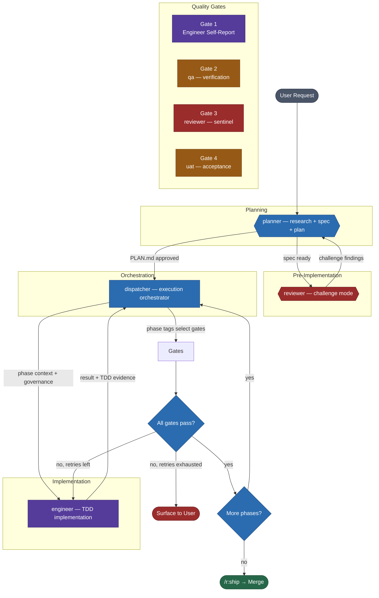
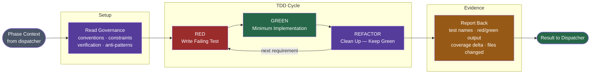
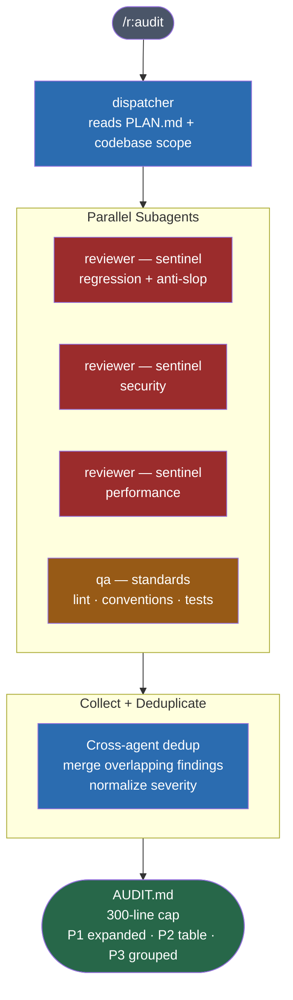
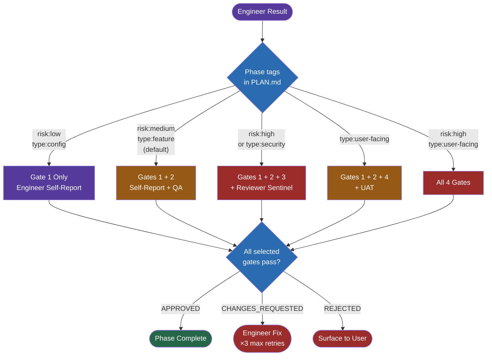
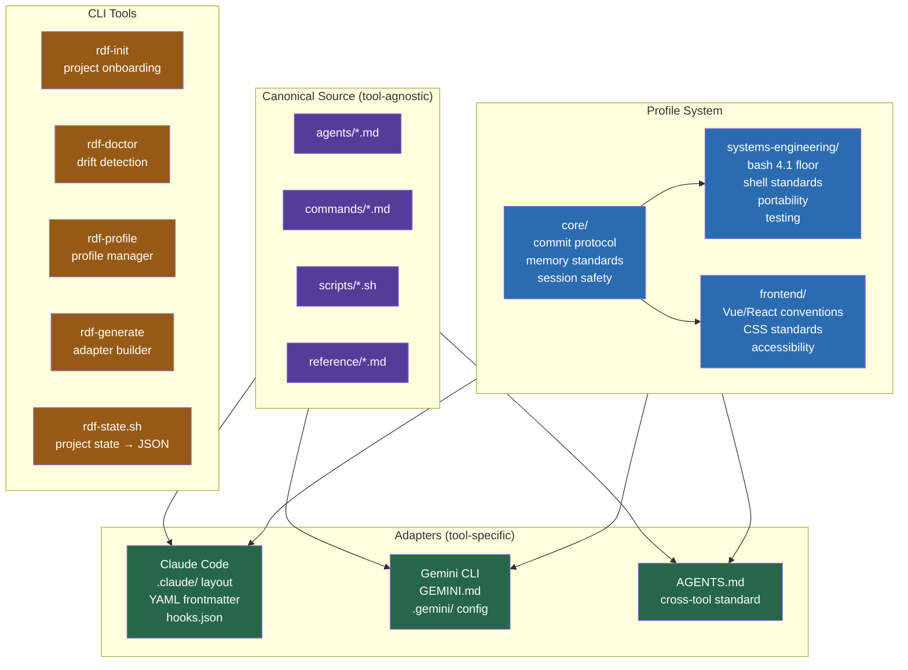
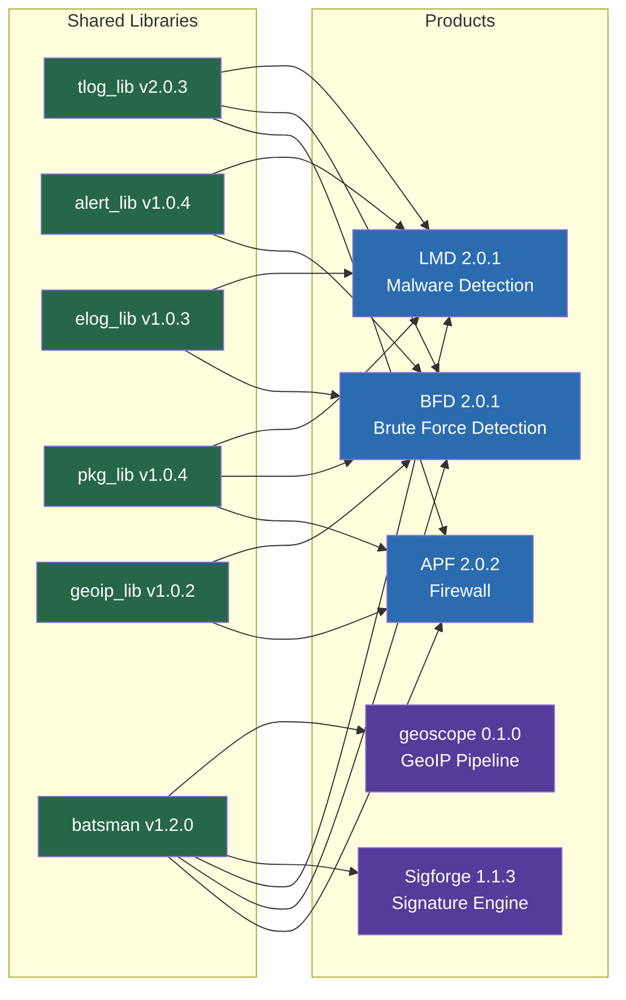
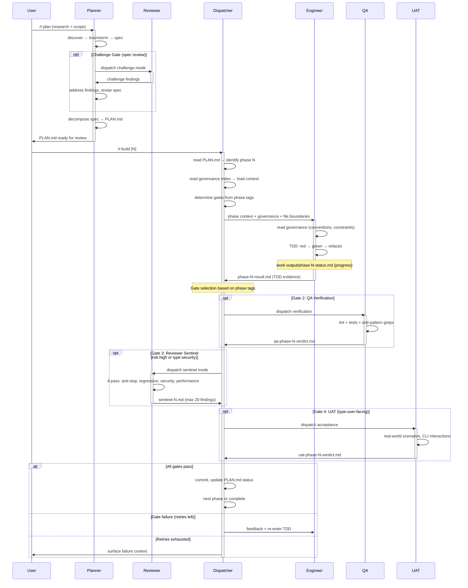
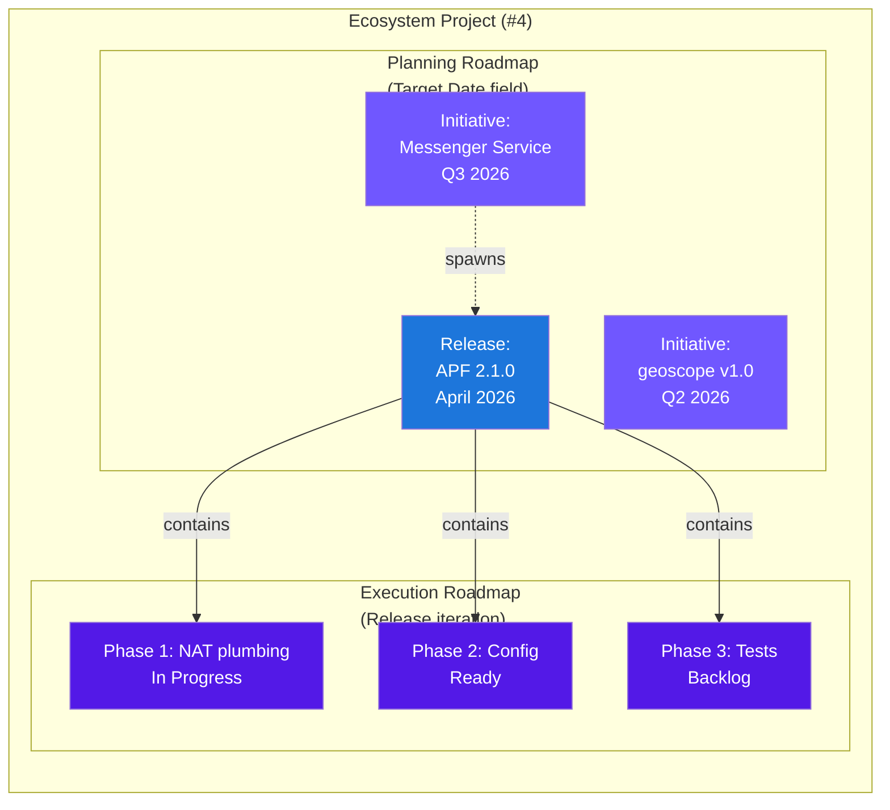

# RDF — Visual Reference

---

## 1. Engineering Pipeline

The v3 lifecycle from user request to merge. Quality gates are selected by
phase tags (risk level + type), not tier classification.



---

## 2. Engineer TDD Protocol



**Step details:**
1. **Setup** — Read governance index, load conventions.md, constraints.md, verification.md, anti-patterns.md for the target project.
2. **Red** — Write a failing test that defines the acceptance criteria from the phase description.
3. **Green** — Write the minimum implementation to make the test pass.
4. **Refactor** — Clean up implementation while keeping all tests green. Repeat Red-Green-Refactor for each requirement.
5. **Evidence** — Report structured evidence: test names, red/green output, coverage delta, files changed.

---

## 3. Reviewer Modes

```mermaid
flowchart TD
    Input([Dispatch from\nplanner or dispatcher]) --> Mode{Mode?}

    Mode -->|challenge| Challenge
    Mode -->|sentinel| Sentinel

    subgraph Challenge Mode — Pre-Implementation
        direction LR
        C1[Design Flaws\narchitectural risks\nmissing constraints]
        C2[Edge Cases\nboundary conditions\nfailure modes]
        C3[Simpler Alternatives\nover-engineering\nexisting solutions]
        C4[Risk Assessment\nblast radius\nrollback complexity]
    end

    Challenge --> COut([challenge findings\nto planner])

    subgraph Sentinel Mode — Post-Implementation
        direction LR
        P1[Pass 1\nAnti-Slop\nnaming lies · copy-paste\npremature abstraction]
        P2[Pass 2\nRegression\nbehavioral continuity\ncaller contracts · exit codes]
        P3[Pass 3\nSecurity\ninjection · credentials\ntemp files · eval]
        P4[Pass 4\nPerformance\nO n² · process spawning\nredundant I/O]
    end

    Sentinel --> SOut([sentinel findings\nmax 20 · to dispatcher])

    style C1 fill:#9b2c2c,color:#fff
    style C2 fill:#9b2c2c,color:#fff
    style C3 fill:#9b2c2c,color:#fff
    style C4 fill:#9b2c2c,color:#fff
    style P1 fill:#9b2c2c,color:#fff
    style P2 fill:#9b2c2c,color:#fff
    style P3 fill:#9b2c2c,color:#fff
    style P4 fill:#9b2c2c,color:#fff
    style Input fill:#4a5568,color:#fff
    style Mode fill:#2b6cb0,color:#fff
    style COut fill:#975a16,color:#fff
    style SOut fill:#975a16,color:#fff
```

| Mode | Lens | Focus | Invoked By |
|------|------|-------|------------|
| Challenge | Design flaws, edge cases, simpler alternatives, risk | Specs and plans (pre-impl) | planner, `/review --challenge` |
| Sentinel: Anti-Slop | Naming lies, copy-paste, premature abstraction | Diffs (post-impl) | dispatcher, `/review --sentinel` |
| Sentinel: Regression | Behavioral continuity, caller contracts, exit codes | Diffs (post-impl) | dispatcher, `/review --sentinel` |
| Sentinel: Security | Injection, credentials, temp files, eval | Diffs (post-impl) | dispatcher, `/review --sentinel` |
| Sentinel: Performance | O(n²), process spawning, redundant I/O | Diffs (post-impl) | dispatcher, `/review --sentinel` |

---

## 4. Audit Pipeline



---

## 5. Quality Gates (Phase-Tag Based)



| Phase Tags | Gates | Agents Involved |
|---|---|---|
| `risk:low, type:config` | 1 | engineer (self-report) |
| `risk:medium, type:feature` (default) | 1 + 2 | engineer + qa |
| `risk:high` or `type:security` | 1 + 2 + 3 | engineer + qa + reviewer sentinel |
| `type:user-facing` | 1 + 2 + 4 | engineer + qa + uat |
| `risk:high, type:user-facing` | 1 + 2 + 3 + 4 | engineer + qa + reviewer sentinel + uat |

---

## 6. RDF Architecture (Target State)



---

## 7. Project Ecosystem



---

## 8. File-Based Handoff



---

## 9. Issue Hierarchy (v2)

GitHub issue granularity: initiatives for planning, releases for versions,
phases for execution, and task-completion comments for progress tracking.


---

## 10. Two-Horizon Roadmap

The ecosystem project provides two roadmap views: Planning (big-picture
timeline by Target Date) and Execution (active work by Release iteration).


