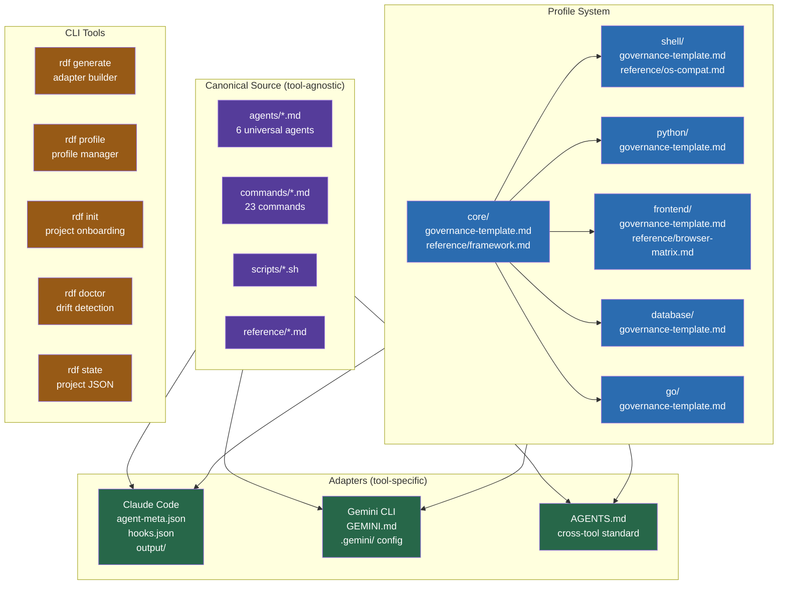
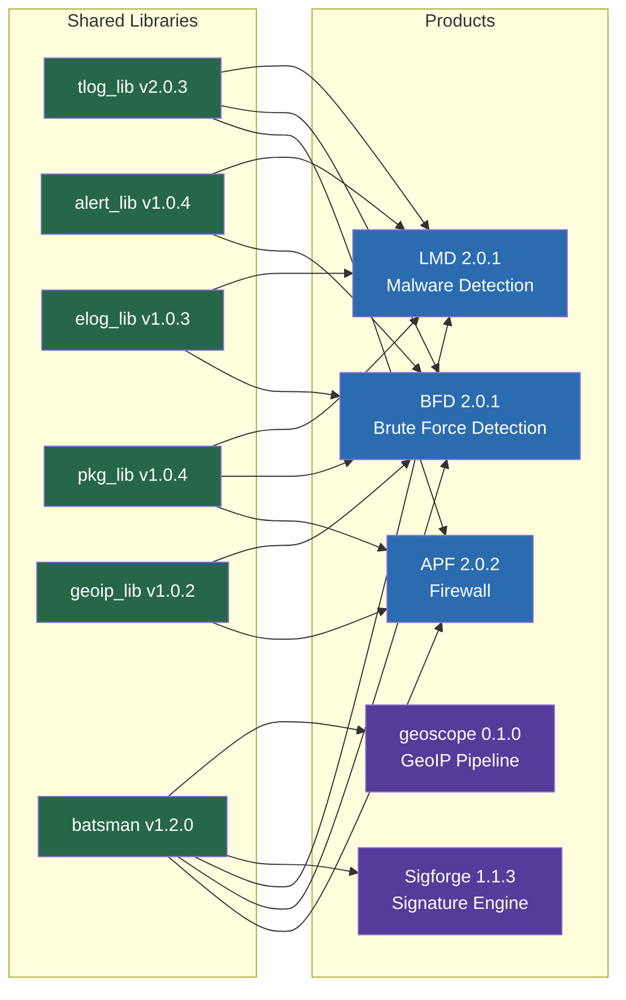
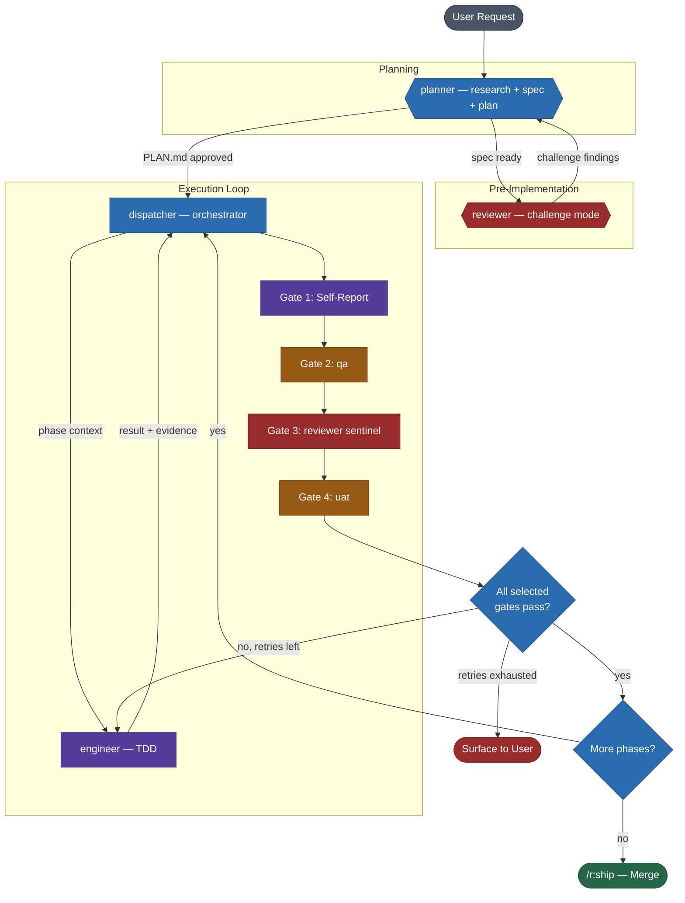
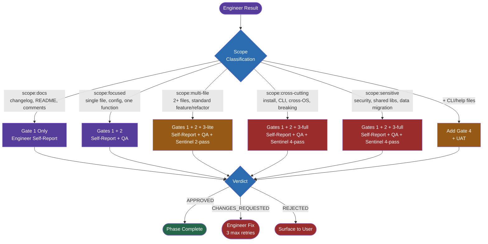
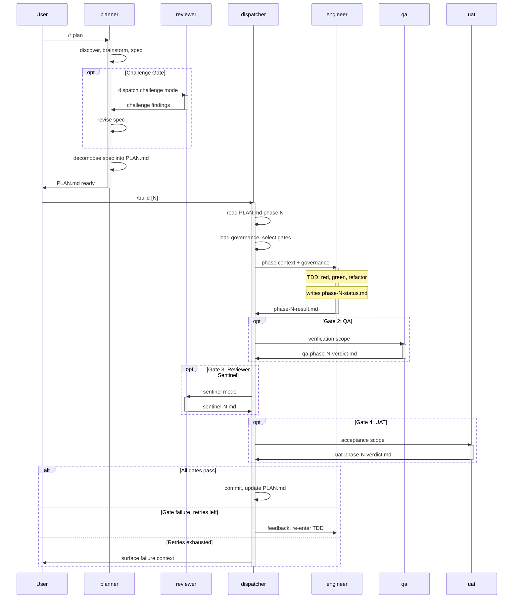
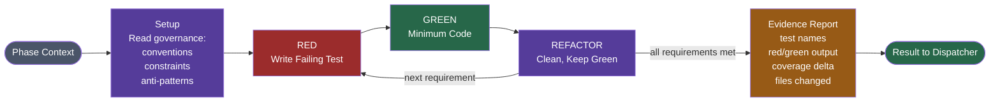
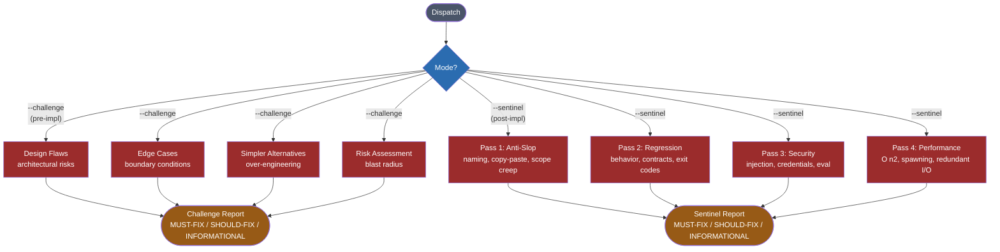
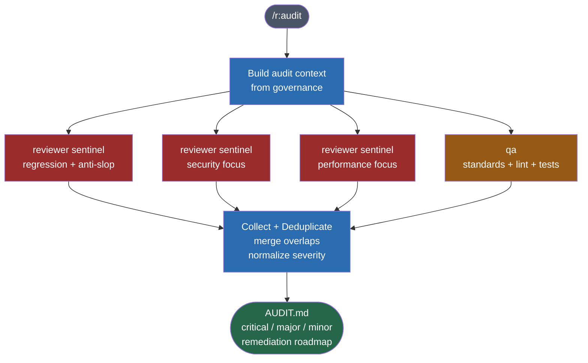
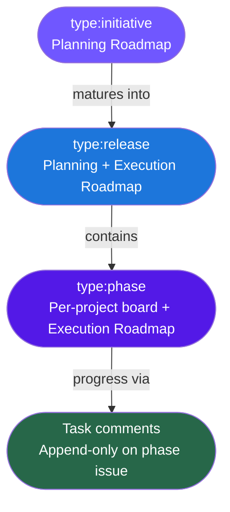
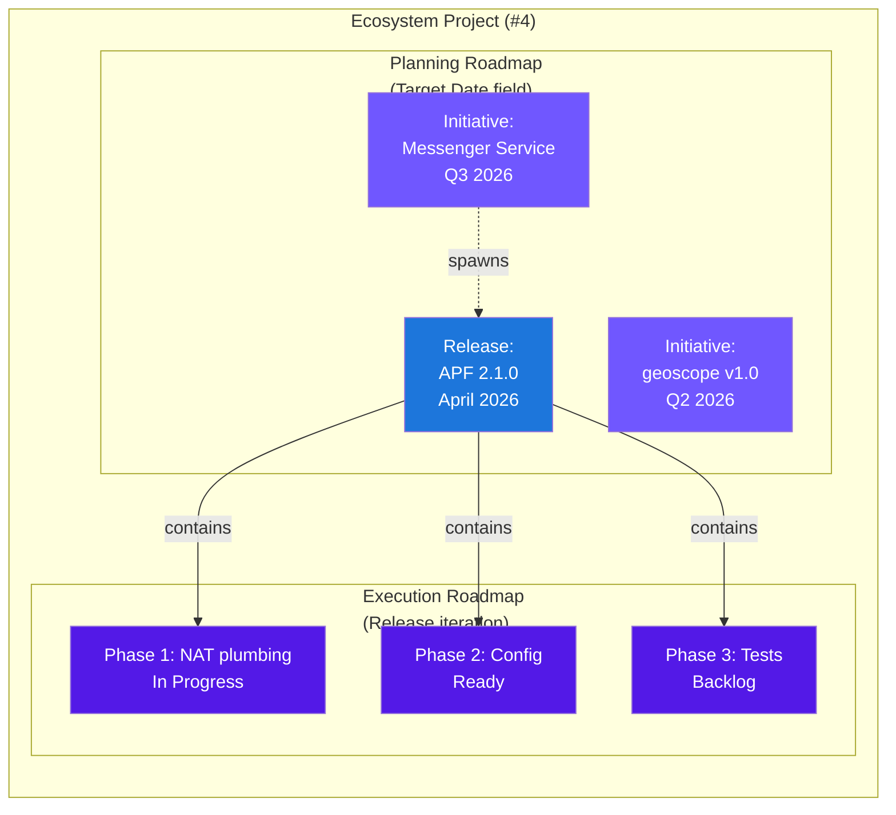

# RDF — Visual Reference

---

## 1. RDF Architecture

System-level overview: canonical sources, profiles, adapters, CLI tools.



---

## 2. Project Ecosystem



---

## 3. Engineering Pipeline

The v3 lifecycle from user request to merge. Quality gates are selected by
scope classification, derived automatically from the phase's file list and
governance context.



---

## 4. Quality Gates (Scope Classification)

Phase content determines which gates the dispatcher activates. Scope is
derived automatically from the file list, description, and governance
context — no manual tagging required.

```
Phase Content → Scope Classification → Gate Selection

  file count       scope:docs          G1
  path patterns    scope:focused       G1+G2
  description      scope:multi-file    G1+G2+G3-lite
  governance       scope:cross-cutting G1+G2+G3-full
  signals          scope:sensitive     G1+G2+G3-full
                   + CLI/help files?   +G4
```



| Scope | Description | Gates | Agents |
|---|---|---|---|
| `docs` | changelog, README, comments | 1 | engineer (self-report) |
| `focused` | single file, config, one function | 1 + 2 | engineer + qa |
| `multi-file` | 2+ files, standard feature/refactor | 1 + 2 + 3-lite | engineer + qa + reviewer (2-pass) |
| `cross-cutting` | install, CLI, cross-OS, breaking changes | 1 + 2 + 3-full | engineer + qa + reviewer (4-pass) |
| `sensitive` | security, shared libs, data migration | 1 + 2 + 3-full | engineer + qa + reviewer (4-pass) |
| any + CLI/help files | user-facing output or help text | add Gate 4 | + uat |

---

## 5. File-Based Handoff

Detailed sequence showing the full v3 lifecycle with file artifacts.



---

## 6. Engineer TDD Protocol

The engineer's implementation cycle, dispatched by the dispatcher.



**Steps:**
1. **Setup** — Read governance index, load conventions, constraints, anti-patterns.
2. **Red** — Write a failing test for the acceptance criteria.
3. **Green** — Minimum implementation to pass.
4. **Refactor** — Clean up, keep green. Repeat for each requirement.
5. **Evidence** — Structured report: test names, red/green output, coverage, files.

---

## 7. Reviewer Modes

The reviewer operates in two modes depending on invocation.



| Mode | Lenses | Focus | Invoked By |
|------|--------|-------|------------|
| Challenge | Design, edge cases, alternatives, risk | Specs and plans | planner, `/review --challenge` |
| Sentinel | Anti-slop, regression, security, performance | Diffs | dispatcher, `/review --sentinel` |

---

## 8. Audit Pipeline

`/r:audit` dispatches 4 parallel subagents, deduplicates findings, outputs AUDIT.md.



---

## 9. Issue Hierarchy

GitHub issue granularity: initiatives for planning, releases for versions,
phases for execution, and task-completion comments for progress tracking.



---

## 10. Two-Horizon Roadmap

The ecosystem project provides two roadmap views: Planning (big-picture
timeline by Target Date) and Execution (active work by Release iteration).


