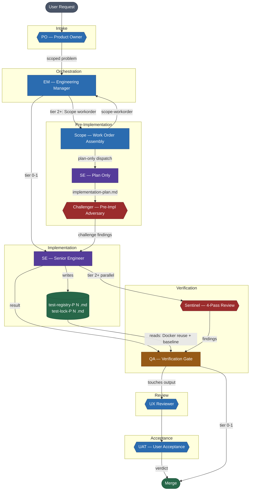
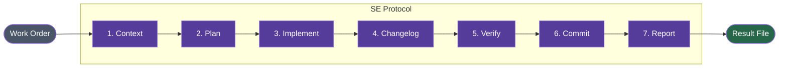
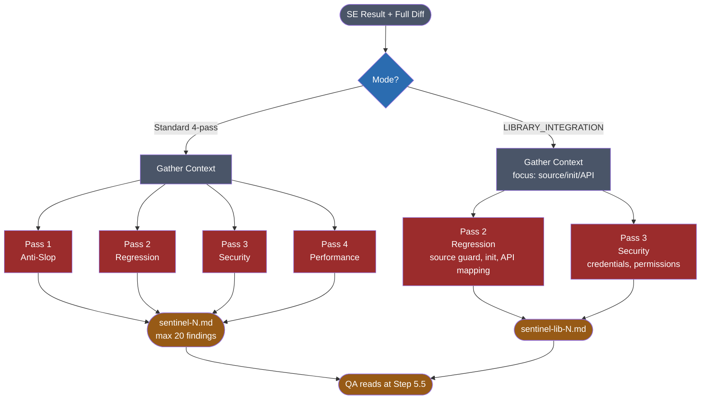
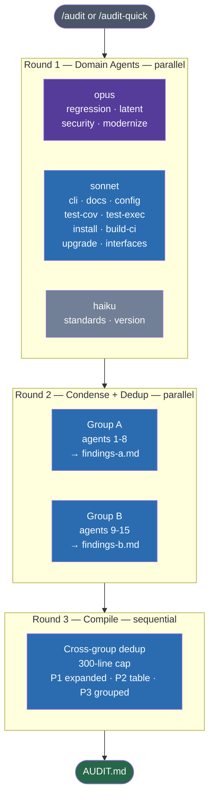
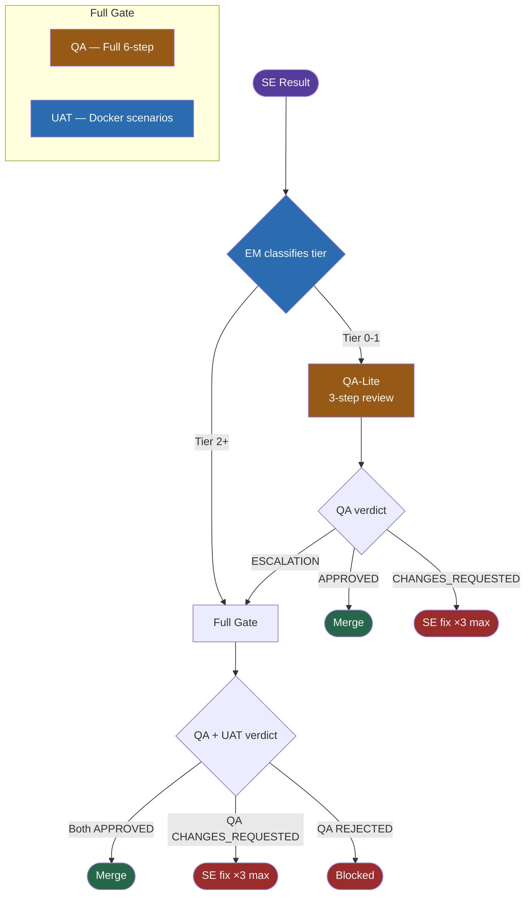
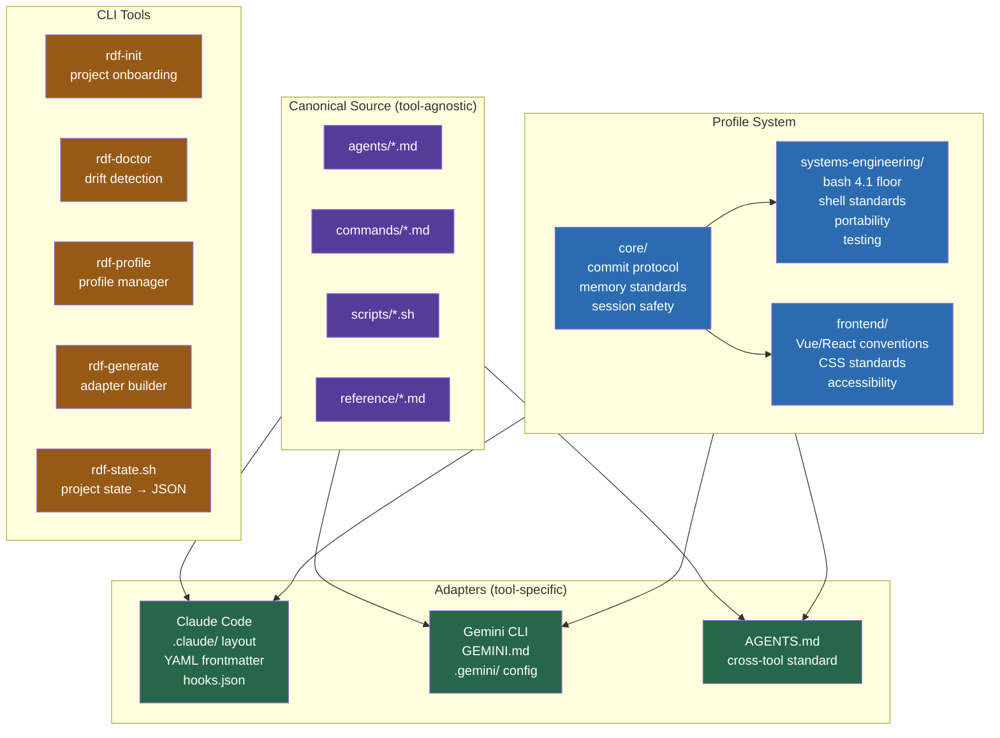
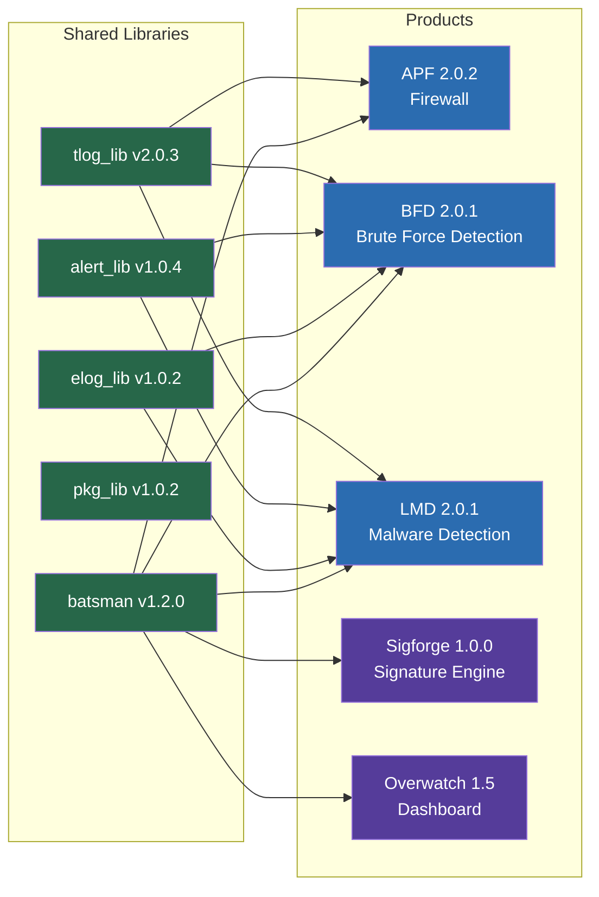
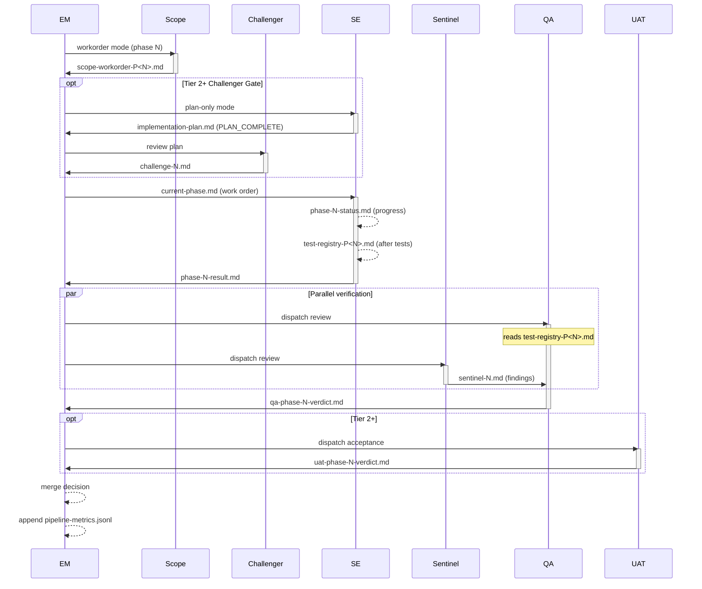

# RDF — Visual Reference

---

## 1. Engineering Pipeline

The main work pipeline from user request to merge. Optional stages in dashed borders.
Tier 2+ changes activate the full gate (Scope, Challenger, Sentinel, UAT).

---

## 2. SE 7-Step Protocol

**Step details:**
1. **Context** — Read CLAUDE.md, MEMORY.md, PLAN.md, AUDIT.md. Grep callers.
2. **Plan** — Design approach. Document trade-offs. Identify bash 4.1 risks.
3. **Implement** — Edit files. Respond to challenge findings.
4. **Changelog** — Update CHANGELOG + CHANGELOG.RELEASE with tagged lines.
5. **Verify** — `bash -n`, shellcheck, anti-pattern greps, run tests, bash 4.1 evidence.
6. **Commit** — Stage by name. Message format per project. No AI attribution.
7. **Report** — Write result file with status, commit hash, verification results.

---

## 3. Sentinel Review (Standard + Library Integration)

| Pass | Lens | Default Severity | Library Integration |
|------|------|-----------------|---------------------|
| Anti-Slop | Naming lies, copy-paste, premature abstraction | SHOULD-FIX | Skipped |
| Regression | Behavioral continuity, caller contracts, exit codes | MUST-FIX | Included |
| Security | Injection, credentials, temp files, eval | MUST-FIX | Included |
| Performance | O(N²), process spawning, redundant I/O | SHOULD-FIX | Skipped |

---

## 4. Audit Pipeline (3-Round)

---

## 5. Verification Gate (Tiered)

---

## 6. RDF Architecture (Target State)

---

## 7. Project Ecosystem

---

## 8. File-Based Handoff

